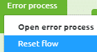
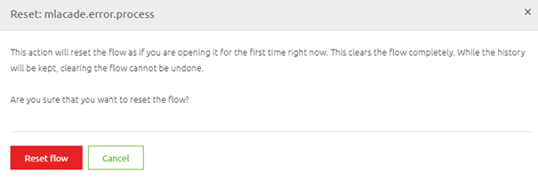
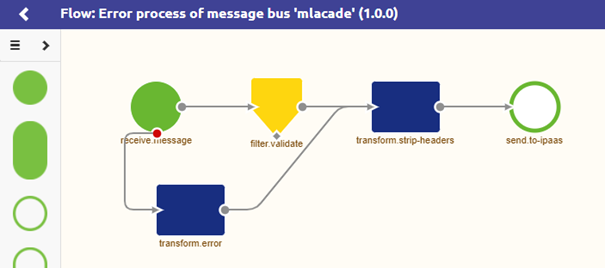

    

        <main class="micro-learning">
        <ul class="doc-nav">
            <li class="doc-nav__item"><a href="../../docs/microlearning/novice-flow-management-index" class="doc-nav__link">Home</a></li>
            <li class="doc-nav__item"><a href="#intro" class="doc-nav__link">Intro</a></li>
            <li class="doc-nav__item"><a href="#theory" class="doc-nav__link">Theory</a></li>
            <li class="doc-nav__item"><a href="#practice" class="doc-nav__link">Practice</a></li>
            <li class="doc-nav__item"><a href="#solution" class="doc-nav__link">Solution</a></li>
        </ul>

##### Intro

# Reset flows

In this microlearning, we will focus on how you can reset a flow and what the impact of the reset action is on your flow.
Sometimes it can come in handy to start your process from scratch without losing the history of what was changed before. For those use cases, we have the Reset flow option in Create

Should you have any questions, please contact academy@emagiz.com.

- Last update: May 5th, 2021
- Required reading time: 5 minutes

## 1. Prerequisites
- Basic knowledge of the eMagiz platform

## 2. Key concepts
This microlearning centers around resetting flows.
With resetting, we mean: Restore the flow in the original state before any manual adjustments were made by a user without losing the history of the flow

- Restore the flow to the original state
- Keep the history
- No option to revert

##### Theory

## 3. Reset flows

In this microlearning, we will focus on how you can reset a flow and what the impact of the reset action is on your flow.
Sometimes it can come in handy to start your process from scratch without losing the history of what was changed before. For those use cases, we have the Reset flow option in Create

Key aspects of resetting a flow are:

- Restore the flow to the original state
- Keep the history
- No option to revert

As you can imagine it can come in handy to Reset a flow in some cases. For example, when a structural change is needed for a complex flow (i.e. the JMS, error flow) you would rather use the latest best practice offered by eMagiz compared to manually migrating it. For those types of flows (as they are not likely to contain manual changes anyway) it can be very helpful to Reset the flow if the release notes of eMagiz indicate such a change.

Furthermore, you might want to reset your flow because you have made too many changes that you want to revert to the original setup. Or perhaps eMagiz has released a standardized template that will make your life easier (i.e. automatic generation of support objects for JSON transformations in messaging) and you want to benefit from those changes.

All in all, there are various reasons why you might consider a Reset of the flow. To perform a reset of a flow you navigate to the Create phase and access the context menu on flow level by right-clicking your mouse on a flow.

When you click on the Reset flow option eMagiz will show you a confirmation pop-up explaining the effect of this action:

If you are convinced that a Reset of the flow is the correct action you should press the Reset flow button. Otherwise, choose the Cancel option. After you have pressed the Reset flow button eMagiz will lead you to the flow in question in Start Editing mode.

This is how you should reset a flow. As said in the beginning always think of the consequences.

##### Practice

## 4. Assignment

Determine whether you can reset a flow without any consequence to the functional process in the flow. If so Reset it. If there is no such flow available please don't Reset anything that others might need
This assignment can be completed with the help of the (Academy) project that you have created/used in the previous assignment.

## 5. Key takeaways

Key aspects of resetting a flow are:

- Restore the flow to the original state
- Keep the history
- No option to revert

##### Solution

## 6. Suggested Additional Readings

If you are interested in this topic and want more information on it please read the help text provided by eMagiz.

## 7. Silent demonstration video

This video demonstrates how you could have handled the assignment and gives you some context on what you have just learned. 

<iframe width="1280" height="720" src="../../vid/microlearning/novice-flow-management-reset-flows.mp4" frameborder="0" allow="accelerometer; autoplay; clipboard-write; encrypted-media; gyroscope; picture-in-picture" allowfullscreen></iframe>   

</main>

