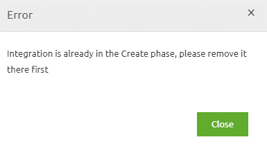
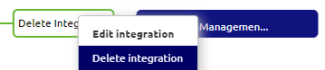
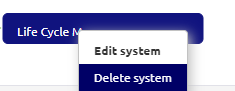

    

        <main class="micro-learning">
        <ul class="doc-nav">
            <li class="doc-nav__item"><a href="../../docs/microlearning/novice-lifecycle-management-index" class="doc-nav__link">Home</a></li>
            <li class="doc-nav__item"><a href="#intro" class="doc-nav__link">Intro</a></li>
            <li class="doc-nav__item"><a href="#theory" class="doc-nav__link">Theory</a></li>
            <li class="doc-nav__item"><a href="#practice" class="doc-nav__link">Practice</a></li>
            <li class="doc-nav__item"><a href="#solution" class="doc-nav__link">Solution</a></li>
        </ul>

##### Intro

# Cleanup a captured integration
 
In this microlearning, we will focus on the last step of cleaning up your integration. As we learned in previous microlearnings, the lifecycle management process starts in Manage and ends in Capture. Following that logic, the last step of the process is to remove the integration from Capture (and potentially the system)

Should you have any questions, please get in touch with academy@emagiz.com.

- Last update: May 14th, 2021
- Required reading time: 5 minutes

## 1. Prerequisites
- Basic knowledge of the eMagiz platform
- Basic knowledge of the build number component within the eMagiz Platform

## 2. Key concepts
This microlearning is about cleaning up a captured integration.

By captured integration, we mean: A line that symbolizes data traffic between a system and eMagiz for which the specific information is filled in (i.e., captured)

There are four essential considerations before cleaning up a captured integration:

- Is the integration/flow not mentioned anymore in any alerting in Manage?
- Is the integration removed from all releases?
- Is the integration removed from Create?
- Is the eMagiz data model (i.e., CDM, API Gateway Data model) cleaned?

##### Theory
  
## 3. Cleanup a captured integration

In this microlearning, we will focus on the last step of cleaning up your integration. As we learned in previous microlearnings, the lifecycle management process starts in Manage and ends in Capture. Following that logic, the last step of the process is to remove the integration from Capture (and potentially the system)

There are four essential considerations before cleaning up a captured integration:

- Is the integration/flow not mentioned anymore in any alerting in Manage?
- Is the integration removed from all releases?
- Is the integration removed from Create?
- Is the eMagiz data model (i.e., CDM, API Gateway Data model) cleaned?

As you can see, a theme starts to develop itself. Each of the considerations focuses on a particular phase within eMagiz. We begin at Manage, move to Deploy, Create and Design before we end up in Capture. Removing integrations in the advised way will ensure that the deletion of the integration and everything that accompanies it will be successful.

However, there is no check done on all these aspects when you want to delete the integration. Therefore it is up to you to uphold the quality. There is one exception to this: the integration needs to be removed from Create before you can clean it up (i.e., delete) in Capture. If the integration is not yet removed from Create, you will see the following pop-up:

To remove an integration in Capture, access the context menu (via a right-mouse click) and select Delete integration.

When selecting this option, eMagiz will ask for confirmation to make sure that you know what you are doing. Confirming that you want to delete the integration means throwing away all captured information, including attached documents. Furthermore, it means that all message mappings, system messages, and design configurations are also gone, except for entities and attributes on the eMagiz data model (CDM, API GW, EVS) level as they are shared.

In cases where the integration you have just cleaned up is the last integration tying a system to eMagiz, you should also delete the system itself. To do so, access the context menu on the system level and select the option Delete system. 

Once again, you will receive a confirmation pop-up. Confirming, in this case, means deleting all captured information on the system level and removing all designed information on the system level.

One last consideration to consider when removing the system is to determine whether your captured system was already part of the Create and Deploy phase of eMagiz. If that was the case, additional measures are needed to properly clean up the system and all related information in the Deploy phase of eMagiz. In that case, you need to Delete your runtime in Deploy on all three environments. More on how to do so can be found in this [microlearning](cleanup-a-deployed-runtime.md). Make note that is an advanced action that only a bus owner can perform within your project. If you did not yet transfer the integration and the system to the Create phase, this action is unnecessary as the runtime does not exist in the Deploy phase.

Armed with this knowledge, you can make the correct decision in cases where you consider cleaning up the captured integration.

##### Practice

## 4. Assignment

Determine whether you can clean up a captured integration within your project. If so, execute the cleanup.
This assignment can be completed with the help of the (Academy) project that you have created/used in the previous assignment.

## 5. Key takeaways

- There are four essential considerations before cleaning up a captured integration:
    - Is the integration/flow not mentioned anymore in any alerting in Manage?
    - Is the integration removed from all releases?
    - Is the integration removed from Create?
    - Is the eMagiz data model (i.e., CDM, API Gateway Data model) cleaned?
- Before deletion, eMagiz will ask for confirmation
- Deletion means that you cannot get it back anymore

##### Solution

## 6. Suggested Additional Readings

If you are interested in this topic and want more information on it, please read the release notes provided by eMagiz

## 7. Silent demonstration video

This video demonstrates how you could have handled the assignment and gives you some context on what you have just learned. 

<iframe width="1280" height="720" src="../../vid/microlearning/novice-lifecycle-management-cleanup-a-captured-integration.mp4" frameborder="0" allow="accelerometer; autoplay; clipboard-write; encrypted-media; gyroscope; picture-in-picture" allowfullscreen></iframe>

</main>

