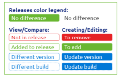
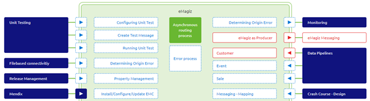
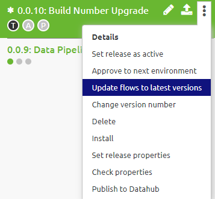
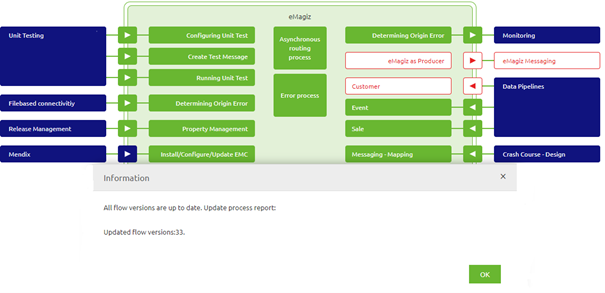

    

        <main class="micro-learning">
        <ul class="doc-nav">
            <li class="doc-nav__item"><a href="../../docs/microlearning/novice-lifecycle-management-index" class="doc-nav__link">Home</a></li>
            <li class="doc-nav__item"><a href="#intro" class="doc-nav__link">Intro</a></li>
            <li class="doc-nav__item"><a href="#theory" class="doc-nav__link">Theory</a></li>
            <li class="doc-nav__item"><a href="#practice" class="doc-nav__link">Practice</a></li>
            <li class="doc-nav__item"><a href="#solution" class="doc-nav__link">Solution</a></li>
        </ul>

##### Intro

# Upgrading Build Numbers
 
In this microlearning, we will focus on how you can upgrade your build numbers within eMagiz consistently and easily. Knowing how to upgrade your build numbers will ensure that you will keep your eMagiz solution as up to date as possible and therefore also as stable and secure as possible.

Should you have any questions, please contact academy@emagiz.com.

- Last update: April 22th, 2021
- Required reading time: 7 minutes

## 1. Prerequisites
- Basic knowledge of the eMagiz platform
- Basic knowledge of the build number component within the eMagiz Platform

## 2. Key concepts
This microlearning centers around upgrading your build numbers.

By upgrading we mean: Ensuring that your eMagiz solution is running on the latest open source and eMagiz software as is possible within the confinements of the customer context
By build number we mean: An identification that the dependency to other pieces of the solution has changed. Each build number has a unique set of dependencies

There are three key considerations when updating build numbers:

- Why should I upgrade my build numbers?
- How do I determine which of my flows can be updated with ease?
- How should I handle the build number upgrade?

##### Theory
  
## 3. Upgrading Build Numbers

In this microlearning, we will focus on how you can upgrade your build numbers within eMagiz consistently and easily. Knowing how to upgrade your build numbers will ensure that you will keep your eMagiz solution as up to date as possible and therefore also as stable and secure as possible. Within this section of the microlearning we will take a look at the three key consideration when updating build numbers:

- Why should I upgrade my build numbers?
- How do I determine which of my flows can be updated with ease?
- How should I handle the build number upgrade?

### 3.1 Why should I upgrade my build numbers?

Build numbers govern all dependencies to other open-source software and govern the ability to use new functionality on flow level within the portal. Therefore by consistently upgrading your build numbers, you ensure that you keep up to date with all the dependencies. This not only prevents surprises when you did not migrate for a long time but also ensures that you are working on the most secure piece of software that is available. Furthermore, by upgrading your build numbers you will unlock the use of new functionality on flow level and you will prevent that you will run into problems because we have stopped supporting certain build numbers.

All in all enough reasons to keep a regular pace to upgrade your build numbers.

### 3.2 How do I determine which of my flows can be updated with ease?

The first trigger will be in the release notes in eMagiz (https://emagiz.github.io/docs/release-notes/index_build.html) and the release blog that is written with every release. Here you can read why a new build number is introduced. Is it because of new functionality, did we update some of the underlying (open source) software or a combination of multiple factors? By reading the release notes you can also easily determine what the possible impact is on your eMagiz solution. For example, if the only change in build number is that a specific component is added or changed and you do not use that (or only limited) the impact is also limited.

As you can already imagine, this judgment call becomes much tougher when you are 10 versions behind compared to when you are 1 or 2 versions behind. Simply because there is less of a gap to identify and analyze. So keep your eye on the release notes and release blog.

Now that you know that there is a new build number and what is exactly changed you can start comparing your current release state to the desired release state (i.e. all flows on the latest build number). You can do this with relative ease with the help of the compare functionality in Deploy -> Releases. As the help infographic on this page tells us you can determine what is changed with the help of how eMagiz color codes the various flows:

As you can see, when a flow indicates a blue dotted line it means the only change between your Create flow and the flow within your release is the build number. These flows are excellent candidates to upgrade as there are no functional changes to consider.

Note that when you are dealing with a functional change in a flow you should consider what the impact would be if you upgrade the flow to the latest build number. Simply because upgrading to the latest build number automatically means upgrading to the latest flow version (regardless of whether functional changes have occurred). If the flow is still in development and not part of a Production (or Acceptance) release there is nothing to worry about as you will use the latest flow version anyway to test your functionality and move it to Production (or Acceptance) at a later stage.

However, when a functional change has occurred and the older flow is running on Production (or Acceptance) you should make a deliberate choice whether or not to move that flow to the latest build number. Once again the decision will become far more complicated when you are a lot of build numbers behind as that might mean that other flows on the same runtime are also not eligible to be upgraded. So once again keep your build numbers updated.

When you can upgrade all flow versions to the latest version eMagiz provides you with a button that will automatically do this for you. This prevents you from clicking through the release several hundred times. If you access the context menu of your release you will see the option called Update flows to the latest version. Pressing this button will automatically upgrade all flows that are part of the release to the latest version.

After you are satisfied with how the release looks you should make it active via the option called Set Release as Active.

### 3.3 How should I handle the build number upgrade?

The reason why you should set your release as Active instead of deploying instantaneously is two-fold:

- As this will impact the complete environment you should communicate and plan a correct date and time to execute the upgrade
- Using the deploy functionality to upgrade your complete project is not considered best practice

Now that you have made the release active you can upgrade your complete project in the following way:

- Stop all entries to ensure that no data is flowing to your project in the midst of upgrading your complete project
- Ensure that you have disabled all alerting
- Upgrade the JMS by installing the new deployment package and starting the new flow.
- Ensure that all other runtimes get stopped, data folder removed (excluding the h2 part), and get started again

By using that logic eMagiz will forget which flows were running on the runtime and the start-up will ask the portal which flows should run. Because you have made the new release active this means that automatically the new and correct flows will be installed and started by eMagiz.

Note that for cloud runtimes you can combine this with a cloud template upgrade or by using the Reset functionality offered by eMagiz in Deploy -> Architecture. Note that for on-premise runtimes you will have to do these steps manually.

When you are finished with all runtimes navigate back to the Releases overview in Deploy and press the Deploy icon to activate your deployment plan. This is a great way to ensure that you did not accidentally miss one or more flows and will automatically ensure that the eMagiz alerting is activated again (assuming you make use of the best practices of eMagiz).

##### Practice

## 4. Assignment

Read up on the release notes of the build numbers and determine for the projects in which you operate what the status is of your eMagiz solution on the eMagiz platform.

## 5. Key takeaways

- Make your life easier by keeping up to date with regards to the build numbers that eMagiz releases
- Determine the impact of the build number upgrade based on the release notes and the comparison functionality
- Communicate before executing the upgrade
- Ensure that data traffic is limited (or even better halted) during the upgrade
- Verify your work by running the deployment plan

##### Solution

## 6. Suggested Additional Readings

If you are interested in this topic and want more information on it please read the release notes provided by eMagiz

## 7. Silent demonstration video

As this is a more theoretical microlearning we have no video for this

</main>

