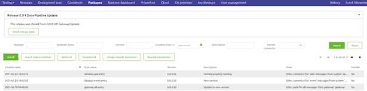

    

        <main class="micro-learning">
        <ul class="doc-nav">
            <li class="doc-nav__item"><a href="../../docs/microlearning/novice-release-management-index" class="doc-nav__link">Home</a></li>
            <li class="doc-nav__item"><a href="#intro" class="doc-nav__link">Intro</a></li>
            <li class="doc-nav__item"><a href="#theory" class="doc-nav__link">Theory</a></li>
            <li class="doc-nav__item"><a href="#practice" class="doc-nav__link">Practice</a></li>
            <li class="doc-nav__item"><a href="#solution" class="doc-nav__link">Solution</a></li>
        </ul>

##### Intro

# (Deployment) Packages

In this microlearning, we will learn what (deployment) packages are and how they are included in the eMagiz platform. In a nutshell, the (deployment) package is a representation of a specific flow version within Create including its resources and including a unique set of dependencies (i.e. the build number reference).

Should you have any questions, please contact academy@emagiz.com.

- Last update: May 6th, 2021
- Required reading time: 5 minutes

## 1. Prerequisites
- Basic knowledge of the eMagiz platform

## 2. Key concepts
This microlearning centers around (deployment) packages.
With a package, we mean: A set of information elements that will ensure that the flow as created works on runtime level

A (deployment) package consists of three parts:

- A specific flow version, identifiable by the first three parts of the version number (i.e. 1.0.3)
- The resources that were linked to the flow
- The set of dependencies that are needed to properly run the flow. This set is identifiable via the build number version (i.e. 57)

As a result:
- The combination of flow version and build number leads to a unique deployment package version (i.e. 1.0.3.57)

##### Theory

## 3. (Deployment) Packages

In this microlearning, we will learn what (deployment) packages are and how they are included in the eMagiz platform. In a nutshell, the (deployment) package is a representation of a specific flow version within Create including its resources and including a unique set of dependencies (i.e. the build number reference).

A (deployment) package consists of three parts:

- A specific flow version, identifiable by the first three parts of the version number (i.e. 1.0.3)
- The resources that were linked to the flow
- The set of dependencies that are needed to properly run the flow. This set is identifiable via the build number version (i.e. 57)

As a result:
- The combination of flow version and build number leads to a unique deployment package version (i.e. 1.0.3.57)

This means that every time you change the flow version eMagiz will create a new (deployment) package that you can include in your Release via the Releases functionality. The same applies when eMagiz launches a new build number. As of that moment, all new flow versions will be packaged with the help of the latest build number. This also leads to a new (deployment) package version.

As said you can deploy all these packages to the correct locations with the help of the Releases functionality. If you need more information on how that works you should revisit the Crash Course Platform to brush up on your knowledge.

Furthermore, eMagiz offers an overview of all (deployment) packages within a release. This overview can be found under Deploy -> Packages. This overview also provides a fallback option to manually install (deployment) packages to the runtime in case the preferred alternative of Releases does not work.

This explanation should hopefully clarify a bit of what happens under the bonnet and how the combination of your flow and the build number work in unison when the solution is deployed.

##### Practice

## 4. Assignment

As this is a more theoretical microlearning we have no assignment for this microlearning.

## 5. Key takeaways

A (deployment) package consists of three parts:

- A specific flow version, identifiable by the first three parts of the version number (i.e. 1.0.3)
- The resources that were linked to the flow
- The set of dependencies that are needed to properly run the flow. This set is identifiable via the build number version (i.e. 57)

As a result:
- The combination of flow version and build number leads to a unique deployment package version (i.e. 1.0.3.57)

##### Solution

## 6. Suggested Additional Readings

If you are interested in this topic and want more information on it please read the help text provided by eMagiz.

## 7. Silent demonstration video

As this is a more theoretical microlearning we have no video for this microlearning.

</main>

