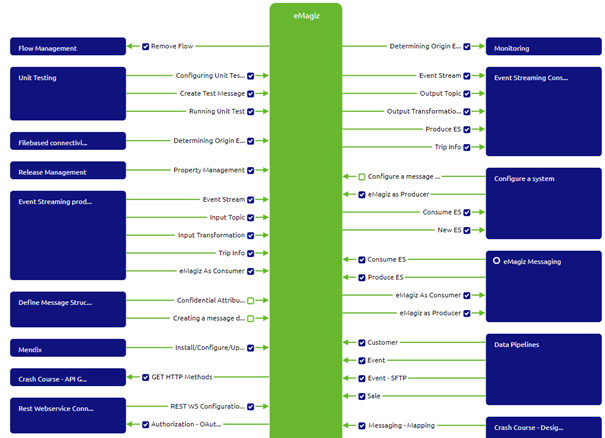
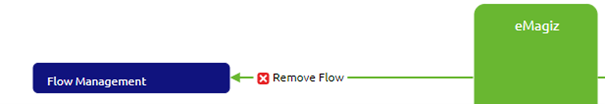
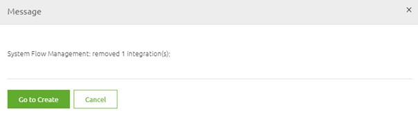

    

        <main class="micro-learning">
        <ul class="doc-nav">
            <li class="doc-nav__item"><a href="../../docs/microlearning/novice-release-management-index" class="doc-nav__link">Home</a></li>
            <li class="doc-nav__item"><a href="#intro" class="doc-nav__link">Intro</a></li>
            <li class="doc-nav__item"><a href="#theory" class="doc-nav__link">Theory</a></li>
            <li class="doc-nav__item"><a href="#practice" class="doc-nav__link">Practice</a></li>
            <li class="doc-nav__item"><a href="#solution" class="doc-nav__link">Solution</a></li>
        </ul>

##### Intro

# Remove flows from Create

In this microlearning, we will focus on how to remove flows from Create and what things to consider before you remove your flows from Create. Whether you want to remove a flow for ever as it has become outdated as part of your lifecycle management or whether you want to temporarily remove and later re-add your flow you can do so with the help of this functionality.

Should you have any questions, please contact academy@emagiz.com.

- Last update: May 5th, 2021
- Required reading time: 5 minutes

## 1. Prerequisites
- Basic knowledge of the eMagiz platform

## 2. Key concepts
This microlearning centers around removing flows from Create.
With removing from Create, we mean: Throwing away all previous work out of Create without keeping track of the history of the flow

- The action removes the flows from the Create overview without containing the history
- The action is a prerequisite for removing the integration in Capture (after it was already Created once)
- Before you execute the action ensure that all references to the old flows are removed from Deploy

##### Theory

## 3. Remove flows from Create

In this microlearning, we will focus on how to remove flows from Create and what things to consider before you remove your flows from Create. Whether you want to remove a flow for ever as it has become outdated as part of your lifecycle management or whether you want to temporarily remove and later re-add your flow you can do so with the help of this functionality. 

Key parts with regards to this functionality are:

- The action removes the flows from the Create overview without containing the history
- The action is a prerequisite for removing the integration in Capture (after it was already Created once)
- Before you execute the action ensure that all references to the old flows are removed from Deploy

As you can imagine there is a need to be able to remove flows from Create after they have previously build. The main reason would be that the system that was once connected to your integration landscape is no longer used or has become out dated. As part of the lifecycle management of your integration landscape we advice to remove those integrations from the Create phase. This functionality helps you with that. Do note that removing a flow from Create is a prerequisite of removing the integration (line) in Capture and Design. So to do proper lifecycle management you start at Manage and work your way back to Capture to correctly and completely remove the solution from your integration landscape

Another potential use case for this functionality is when you have made a mistake in Design or Capture with regards to directionality or naming. In those cases you can also remove the flows from Create and re-add it on a later moment in time when those aspects are configured properly. Do note that not all configuration changes in Design or Capture need to be preceeded by removing the flows from Create. In general most of what is in Design and Capture can be changed after an integration has been moved to Create. The exceptions to this rule are:

- Technical name of the system and/or integration
- Directionality (does eMagiz send data to the system or does it receive data from the system)
- The chosen integration pattern (i.e. Event Streaming, API Gateway or Messaging)
- Whether the integration is synchronous or asynchronous

All in all, there are various reasons why you might consider to remove flows from Create. To remove flows from Create you navigate to the Create phase and press on the button located at the left-hand bottom of the screen called Add integrations. This action will lead you to the following overview

In this overview you can see which integrations have not yet been added (indicated by the empty box with a green line) and you can see which integrations have been added to Create (indicated by the blue box with the checkmark). Those integrations that have been added previously are candidates for removal. You can remove the integration from Create by clicking on it. The widget will indicate the intended action by turning the blue box with the checkmark to a red box with a cross in the middle.

The moment you are satisfied with your choices you should press the Save selection button, located on the left-hand bottom of the screen. As a result eMagiz will notify you whether the removal has been succesfull or not. This way you now whether your action was succesful. Afterwards you can go back to the Create overview by clicking on the Go to Create option.

Now you have learned how to remove a flow from Create. As always think before you start to randomly remove stuff from Create as you cannot get it back anymore.

##### Practice

## 4. Assignment

Determine whether there is a integration that is deemed out of life and can therefore be removed with ease.  If there is no such integration available please don't remove anything that others might need.
This assignment can be completed with the help of the (Academy) project that you have created/used in the previous assignment.

## 5. Key takeaways

- The action removes the flows from the Create overview without containing the history
- The action is a prerequisite for removing the integration in Capture (after it was already Created once)
- Before you execute the action ensure that all references to the old flows are removed from Deploy

##### Solution

## 6. Suggested Additional Readings

If you are interested in this topic and want more information on it please read the help text provided by eMagiz.

## 7. Silent demonstration video

This video demonstrates how you could have handled the assignment and gives you some context on what you have just learned. 

<iframe width="1280" height="720" src="../../vid/microlearning/novice-flow-management-remove-flows-from-create.mp4" frameborder="0" allow="accelerometer; autoplay; clipboard-write; encrypted-media; gyroscope; picture-in-picture" allowfullscreen></iframe>	

</main>

