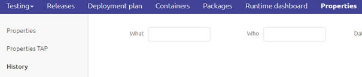
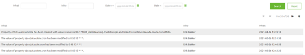

    

        <main class="micro-learning">
        <ul class="doc-nav">
            <li class="doc-nav__item"><a href="../../docs/microlearning/novice-release-management-index" class="doc-nav__link">Home</a></li>
            <li class="doc-nav__item"><a href="#intro" class="doc-nav__link">Intro</a></li>
            <li class="doc-nav__item"><a href="#theory" class="doc-nav__link">Theory</a></li>
            <li class="doc-nav__item"><a href="#practice" class="doc-nav__link">Practice</a></li>
            <li class="doc-nav__item"><a href="#solution" class="doc-nav__link">Solution</a></li>
        </ul>

##### Intro

# Property History

In this microlearning, we will focus on the history of properties. In previous microlearnings, we already discussed the concept of properties. The focus for this microlearning will be learning how you can see who changed which property when. As you can imagine this is ideal for audit purposes but also can be a big help when analyzing the behavior of the flow.

Should you have any questions, please contact academy@emagiz.com.

- Last update: May 6th, 2021
- Required reading time: 5 minutes

## 1. Prerequisites
- Basic knowledge of the eMagiz platform

## 2. Key concepts
This microlearning centers around property history.
With property history, we mean: A visual audit trail of who changed what at which point in time

There are two main use cases for this overview

- It gives you the ability to prove what has changed by whom and when. This is important when you get audited
- It gives you the ability to analyze certain behavior and based on the property history overview draw conclusion

##### Theory

## 3. Property History

In this microlearning, we will focus on the history of properties. In previous microlearnings, we already discussed the concept of properties. The focus for this microlearning will be learning how you can see who changed which property when. As you can imagine this is ideal for audit purposes but also can be a big help when analyzing the behavior of the flow.

There are two main use cases for this overview

- It gives you the ability to prove what has changed by whom and when. This is important when you get audited
- It gives you the ability to analyze certain behavior and based on the property history overview draw conclusion

The property history overview in eMagiz is an overview page that defines on a per-environment basis (i.e. a separated overview for Test, Acceptance, and Production) which properties have been created and/or changed, who changed them and when they were changed.

This overview is located within the property context in Deploy. So when you navigate to Deploy and open the properties overview you will see on your left-hand side several menu options. One of these options is called History.

By clicking on it an overview will be presented to the user that defines what has changed, by whom, and when.

As the above picture shows within this overview you can filter on the property name (what), users (who), and date (when) to focus your search for answers. This is in a nutshell what the property history overview is good for and how to use it to your advantage.

##### Practice

## 4. Assignment

Navigate to the property history overview under properties and see if you can analyze for a couple of properties how they have changed over time.
This assignment can be completed with the help of the (Academy) project that you have created/used in the previous assignment.

## 5. Key takeaways

- The history overview is located in Deploy under Properties
- It gives you the ability to prove what has changed by whom and when. This is important when you get audited
- It gives you the ability to analyze certain behavior and based on the property history overview draw conclusion

##### Solution

## 6. Suggested Additional Readings

If you are interested in this topic and want more information on it please read the help text provided by eMagiz.

## 7. Silent demonstration video

This video demonstrates how you could have handled the assignment and gives you some context on what you have just learned. 

<iframe width="1280" height="720" src="../../vid/microlearning/novice-release-management-property-history.mp4" frameborder="0" allow="accelerometer; autoplay; clipboard-write; encrypted-media; gyroscope; picture-in-picture" allowfullscreen></iframe>   

</main>

