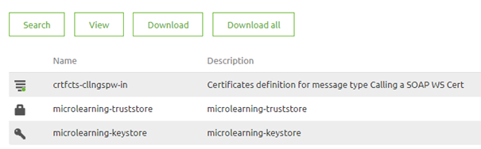
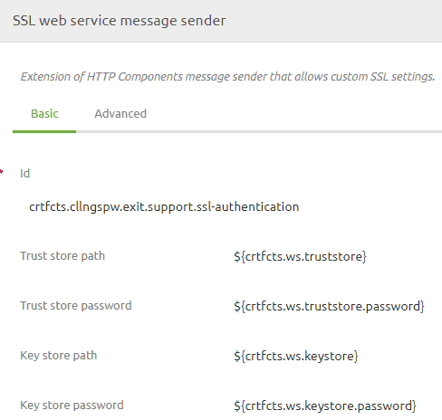

    

        <main class="micro-learning">
        <ul class="doc-nav">
            <li class="doc-nav__item"><a href="../../docs/microlearning/novice-securing-your-data-traffic-index" class="doc-nav__link">Home</a></li>
            <li class="doc-nav__item"><a href="#intro" class="doc-nav__link">Intro</a></li>
            <li class="doc-nav__item"><a href="#theory" class="doc-nav__link">Theory</a></li>
            <li class="doc-nav__item"><a href="#practice" class="doc-nav__link">Practice</a></li>
            <li class="doc-nav__item"><a href="#solution" class="doc-nav__link">Solution</a></li>
        </ul>

##### Intro

# Sending certificates to a webservice
 
In this microlearning, we will learn how you can send a certificate to a SOAP web service.

Should you have any questions, please contact academy@emagiz.com.

- Last update: April 22th, 2021
- Required reading time: 5 minutes

## 1. Prerequisites
- Basic knowledge of the eMagiz platform
- Basic Understanding of certificates
- Valid Keystore (and Truststore)

## 2. Key concepts
This microlearning centers around learning how to send a client certificate (and potentially trust a client certificate).

By certificates we mean: A trustworthy document that is interchanged between parties to verify that both parties are who they claim to be

In most cases when you send a certificate to a web service we talk about sending a client certificate along with the web service call.
In some cases however the endpoint we call is not secured via a certificate chain containing a CA. In those cases, we need to explicitly trust the party to whom we are sending data by placing data in the truststore.

In another microlearning, we will learn how to create the keystore and truststore. The focal point of this microlearning is how you need to configure eMagiz correctly to make this work.

##### Theory
  
## 3. Sending certificates to a webservice

In this microlearning, we will learn how you can send a certificate to a SOAP web service.

In most cases when you send a certificate to a web service we talk about sending a client certificate along with the web service call.
In some cases however the endpoint we call is not secured via a certificate chain containing a CA. In those cases, we need to explicitly trust the party to whom we are sending data by placing data in the truststore.

In the remainder of this section, we will step by step navigate you through the required steps that are needed to ensure that the keystore and truststore are properly linked to the flow and the component that is executing the SOAP web service call. The journey starts in the Create phase of eMagiz.

The first step is to open the flow in which you want to call a SOAP web service. Within the flow enter "Start Editing" mode. The first component you should check for is whether the flow you have just opened already has a web service outbound gateway. This component should be at the end of your flow.

After you have confirmed that such a component is indeed available in your flow please navigate to the Resources tab in the flow. In this tab, you see all Resources that are linked to the flow. For this exercise, we need to upload the key- and truststore via the button Upload New Resource. As a result, the resources overview should look similar as follows:

Now that we have uploaded the correct resources we need to download them again. The reason why we need to download them again is that eMagiz gives every document a unique name by adding a prefix to the name. This prefix is crucial to have as you need to use it to refer to the correct resource later on.

The next step is to move back to the flow and add the support object called SSL web service message sender. Give the component a name and open it. Subsequently fill in the required fields (keystore path, keystore password, truststore path, truststore password). 

Note: In case of update validate whether the alias field on the Advanced tab is used. If so verify if the alias still corresponds with what is registered in the keystore.

When you are happy with your configuration close the pop-up and open the web service outbound component. Navigate to the advanced tab in this component and link the SSL web service message sender component to this functional component.

This concludes the configuration of the flow. Press "Stop Editing" and create a new version of the flow. The only task remaining is to create properties (per environment) that refer to the paths and the password. The paths should be noted as: “resources/[filename of the key- or truststore]”. The password property should simply refer to the password.

##### Practice

## 4. Assignment

Configure an exit in which you call a SOAP web service and make sure that you send along a keystore and a truststore with the call.

## 5. Key takeaways

- Certificates are all about trust
- With the help of the SSL web service message sender you can use certificates when calling a SOAP web service
- Always remember that eMagiz uses prefixes to make resources unique

##### Solution

## 6. Suggested Additional Readings

If you are interested in this topic and want more information on it please read the release notes provided by eMagiz

## 7. Silent demonstration video

<iframe width="1280" height="720" src="../../vid/microlearning/novice-securing-your-data-traffic-sending-certificates-to-a-webservice.mp4" frameborder="0" allow="accelerometer; autoplay; clipboard-write; encrypted-media; gyroscope; picture-in-picture" allowfullscreen></iframe>

</main>

