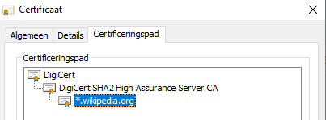

    

        <main class="micro-learning">
        <ul class="doc-nav">
            <li class="doc-nav__item"><a href="../../docs/microlearning/novice-securing-your-data-traffic-index" class="doc-nav__link">Home</a></li>
            <li class="doc-nav__item"><a href="#intro" class="doc-nav__link">Intro</a></li>
            <li class="doc-nav__item"><a href="#theory" class="doc-nav__link">Theory</a></li>
            <li class="doc-nav__item"><a href="#practice" class="doc-nav__link">Practice</a></li>
            <li class="doc-nav__item"><a href="#solution" class="doc-nav__link">Solution</a></li>
        </ul>

##### Intro

# What are certificates
 
In this microlearning, we will focus on what certificates are and will relate this to how you could use them to secure your data traffic.

Should you have any questions, please contact academy@emagiz.com.

- Last update: April 22th, 2021
- Required reading time: 7 minutes

## 1. Prerequisites
- Basic knowledge of the eMagiz platform

## 2. Key concepts
This microlearning centers around what are certificates.

By certificates we mean: A trustworthy document that is interchanged between parties to verify that both parties are who they claim to be

Certificates can be used in many forms. Two distinct forms are:

- Authenticate
- Encrypt

Within eMagiz we usually see that configurable certificates are used for authentication:
- eMagiz to an external party
- External party to eMagiz

##### Theory
  
## 3. What are certificates

In this microlearning, we will focus on what certificates are and will relate this to how you could use them to secure your data traffic.

Certificates can be used in many forms. Two distinct forms are:

- Authenticate
- Encrypt

Within eMagiz we usually see that configurable certificates are used for authentication:
- eMagiz to an external party
- External party to eMagiz

The remainder of this section will be spent explaining as well as possible what certificates are. The first question we should ask ourselves to get clarification on the topic is:

- What are certificates used for?

### 3.1 What are certificates used for?

One application of the use of certificates lies in the authentication. With certificates in this form, you have a method of verifying that the person that claims to be a certain individual is indeed that individual. One application lies in the encryption of data when it is being exchanged between two parties. This ensures that an independent third party cannot see what data is exactly exchanged between these two parties.

To clarify these concepts in a better way let us consider the following example that takes place in medieval times. Imagine that you needed to bring a treasure to a certain location (castle X, castle Y, etc.). Note that the medieval location could be the URL of today (www.google.com, my.emagiz.com, etc.)

To successfully finish this quest you as a person (or computer) would need to know how that castle looks like, where the castle is exactly located, etc. But what if you do not know those pieces of the puzzle? How can you be sure that you are delivering the treasure to the correct castle? In medieval times we had banners for such identification. Each castle, or group of individuals, was using a distinctive banner. With the help of such a banner, you can identify the correct location. This is in essence the same with certificates. A certificate is in other words an identification document linked to a location.

Sounds simple right? But what if an evil warlord creates an identical banner (i.e. certificate)? How can you discern between those two certificates? To guard against these practices you can sign a certificate. In medieval times documents would have been signed with a sigil for example. Nowadays we call that the private key.

To summarize a certificate contains a public part (that can be distributed freely to all within the realm) and a private part (that you should guard with your life).

The next step of the complexity lies in the private key. How can you know for sure that the private key is unique and trustworthy? What guarantees do you have when the other party has issued their private key? Such practice is what we call a self-signed certificate.

To mitigate these practices we have entities in the world called Certificate Authorities (CA). Such a CA will sign the certificate to ensure that the certificates can be trusted by others.

If you look for example at a server certificate (accessible via the lock icon in your browser) you will see that a certificate is issued to a certain domain, issued by a certain entity (CA), and has a certain expiration date. You can even see the full certificate chain (i.e. a certificate is signed by a certificate that is signed by another certificate). Note that when a certificate higher up in the chain is blacklisted (because of fraudulent practices) all certificates that were signed by that certificate are also automatically blacklisted.

In other words, certificates resolve all-around trust. As long as the certificate is trusted everything works well, the moment the certificate is not trusted any more communication will stop eventually.

Above we have talked about you trusting the other party. But what about the other way around? How can the castle to which you are delivering the treasure trust who you are and now that you bring treasure?
To prove that you are who you say you are you can hand them a certificate. We call that a client certificate.

To recap, you have a server certificate (belonging to the party that receives the request) and you have a client certificate (belonging to the party that executes the request). With the help of a client certificate, a server can limit who can gain access to the server based on the certificate they provide at the door. If a server is publicly accessible but makes use of a certificate we say the connection is secured with the help of one-way SSL (HTTPS traffic). If the server requires a client certificate we talk about two-way SSL.

### 3.2 What if I want to use a self-signed certificate?

There is no technical requirement to always use certificates that are signed by a CA. Another approach is to create a self-signed certificate. This way the party that receives the request will look in the so-called truststore. The truststore houses all certificates (public keys) of trusted parties. 

By default, Java has such a truststore that contains all trusted CA's. Which CA's are located in the default Java truststore depends on the Java version you are currently running on. You can verify this by checking the cacerts truststore in the Java installation located in "pathToJava\lib\security\cacerts". In case the server deviates from this you should create your truststore which should include the certificate of the server you want to call.

Logically when you want to reply (or send something) you want to sign your certificate with something that is only known to you. To store this safely you can use a keystore. In here you store the secret that is only known to you (the private key) for safekeeping.

The combination of such a private key and a public key is called a key pair.

### 3.3 How to get your key signed by a trusted party

In some cases, an external party with whom we do business asks us to manage the certificate but has the requirement that the certificate that we have created and manage needs to be signed by a trusted party before it can be used in the field. To do you need to create a certificate signing request. You can do this with the help of tools such as Keystore Explorer, more on the technical details in a later microlearning.

When you generate a certificate or a certificate signing request you need to create a key pair. The most crucial part of this process is the common name (CN). For Server certificates, this should contain the URL, for Client certificates this should be a client name or a client id. The best practice is to use the technical name of the runtime in eMagiz (possibly in conjunction with the tenant name in case of multi-tenancy).

After you have configured this correctly you should secure it via a password and save it. From here on you can create a certificate signing request (CSR). After a while, you will get a response back from the CA. You can link this to your keypair via an Import CA Reply. The result can be seen in Keystore Explorer.

### 3.4 Encryption

To ensure encryption the client locks the data with the help of the public key in a format that can only be read by the intended party. At that point, only the party that has the matching private key has the option to decrypt the message and process it.

##### Practice

## 4. Assignment

Read up on certificates and how they work in communication with other parties and see if you get what the function of certificates is.

## 5. Key takeaways

- Certificates are all about trust
- When a certificate is trusted by a CA it is natively trusted by others
- In the case of self-signed certificates you need key stores and truststores to keep the private and public info secure
- With the help of a certificate signing request (CSR) you can let a CA sign your certificate

##### Solution

## 6. Suggested Additional Readings

If you are interested in this topic and want more information on it please read the release notes provided by eMagiz

## 7. Silent demonstration video

<iframe width="1280" height="720" src="https://youtu.be/7TxZGQKXZnQ" frameborder="0" allow="accelerometer; autoplay; clipboard-write; encrypted-media; gyroscope; picture-in-picture" allowfullscreen></iframe>

</main>

