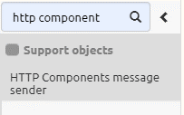
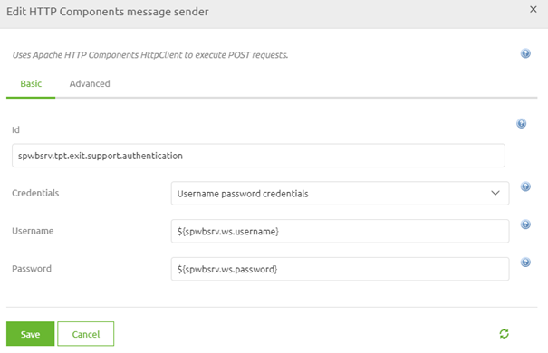
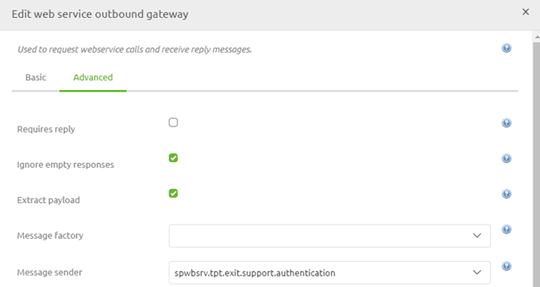

    

        <main class="micro-learning">
        <ul class="doc-nav">
            <li class="doc-nav__item"><a href="../../docs/microlearning/novice-soap-webservice-connectivity-index" class="doc-nav__link">Home</a></li>
            <li class="doc-nav__item"><a href="#intro" class="doc-nav__link">Intro</a></li>
            <li class="doc-nav__item"><a href="#theory" class="doc-nav__link">Theory</a></li>
            <li class="doc-nav__item"><a href="#practice" class="doc-nav__link">Practice</a></li>
            <li class="doc-nav__item"><a href="#solution" class="doc-nav__link">Solution</a></li>
        </ul>

##### Intro

# Authorization - Calling a SOAP Webservice
 
When talking to external parties via a SOAP web service they will most likely require some form of authorization. Within eMagiz, you have various options to send the correct authorization towards that external system. The one that is most used when communicating with external parties is a username/password combination (i.e. basic authentication). In this microlearning, we will focus on that scenario and discuss some of the other possibilities that eMagiz offers out of the box.

Should you have any questions, please contact academy@emagiz.com.

- Last update: June 11th, 2021
- Required reading time: 5 minutes

## 1. Prerequisites
- Basic knowledge of the eMagiz platform

## 2. Key concepts
This microlearning centers around the endpoint check.

By authorization, we mean: The act of proving to the external party that you are indeed who you claim to be

- Main form used is a username/password combination (i.e. basic authentication)
- Other standard eMagiz options are:
    - Mendix authentication
    - Metacom authentication
    - Zimbra authentication

##### Theory
  
## 3. Authorization - Calling a SOAP Webservice

When talking to external parties via a SOAP web service they will most likely require some form of authorization. Within eMagiz, you have various options to send the correct authorization towards that external system. The one that is most used when communicating with external parties is a username/password combination (i.e. basic authentication). In this microlearning, we will focus on that scenario and discuss some of the other possibilities that eMagiz offers out of the box.

- Main form used is a username/password combination (i.e. basic authentication)
- Other standard eMagiz options are:
    - Mendix authentication
    - Metacom authentication
    - Zimbra authentication

### 3.1 Username password credentials

To set up the authorization we need to navigate to the Create phase of eMagiz and open the flow in which we want to add the authorization. Here we can add a support object called HTTP Components message sender. 

When you open the component you can choose Username password credentials in the drop-down and fill in properties to represent the password and username.

After you have done so you can link the support object to the functional component by double-clicking on the functional component, navigate to the Advanced tab and select the correct message sender.

### 3.2 Alternatives

Some alternatives that eMagiz offers for authentication in combination with calling a SOAP web service are:

- Mendix authentication
- Metacom authentication
- Zimbra authentication

To learn the specifics of each of these options please read the help text on these components to determine whether they can help you build a successful integration.

##### Practice

## 4. Assignment

Set the standard authorization on an external SOAP web service that you want to call.
This assignment can be completed with the help of the (Academy) project that you have created/used in the previous assignment.

## 5. Key takeaways

- Main form used is a username/password combination (i.e. basic authentication)
- Other standard eMagiz options are:
    - Mendix authentication
    - Metacom authentication
    - Zimbra authentication
- Make sure to link the support object to the functional component

##### Solution

## 6. Suggested Additional Readings

If you are interested in this topic and want more information on it please read the help text provided by eMagiz.

## 7. Silent demonstration video

<iframe width="1280" height="720" src="../../vid/microlearning/novice-soap-webservice-connectivity-authorization-calling-a-soap-webservice.mp4" frameborder="0" allow="accelerometer; autoplay; clipboard-write; encrypted-media; gyroscope; picture-in-picture" allowfullscreen></iframe>

</main>

