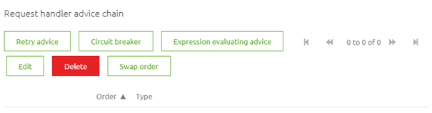
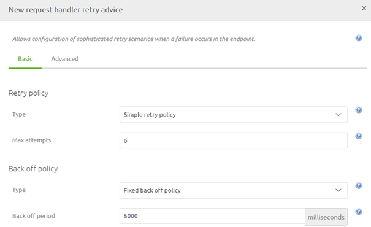

    

        <main class="micro-learning">
        <ul class="doc-nav">
            <li class="doc-nav__item"><a href="../../docs/microlearning/novice-soap-webservice-connectivity-index" class="doc-nav__link">Home</a></li>
            <li class="doc-nav__item"><a href="#intro" class="doc-nav__link">Intro</a></li>
            <li class="doc-nav__item"><a href="#theory" class="doc-nav__link">Theory</a></li>
            <li class="doc-nav__item"><a href="#practice" class="doc-nav__link">Practice</a></li>
            <li class="doc-nav__item"><a href="#solution" class="doc-nav__link">Solution</a></li>
        </ul>

##### Intro

# Calling a SOAP Webservice
 
When talking to external parties via a SOAP web service you need to define in eMagiz that you want to call a SOAP web service so eMagiz will form a correct SOAP message. On top of the call there is a support object in eMagiz that will help you with the analysis of your problems when calling the SOAP web service. In this microlearning, we will learn how to call a SOAP web service from eMagiz.

Should you have any questions, please contact academy@emagiz.com.

- Last update: April 1st, 2022
- Required reading time: 5 minutes

## 1. Prerequisites
- Basic knowledge of the eMagiz platform

## 2. Key concepts
This microlearning centers around calling a SOAP Webservice.

With SOAP, we mean:  A messaging protocol specification for exchanging structured information in the implementation of web services in computer networks.

- To call a REST Webservice you need either:
    - A Web Service Outbound Gateway
- Critical information when configuring this component:
    - URL
    - Retry Advice
    - Error Handling
    - Authentication

##### Theory
  
## 3. Calling a SOAP Webservice

When talking to external parties via a SOAP web service you need to define in eMagiz that you want to call a SOAP web service so eMagiz will form a correct SOAP message. On top of the call there is a support object in eMagiz that will help you with the analysis of your problems when calling the SOAP web service. In this microlearning, we will learn how to call a SOAP web service from eMagiz.

Calling a SOAP Webservice within eMagiz can be done with the help of a Web Service Outbound Gateway. To correctly configure this component you need to consider the following elements:

- URL
- Retry Advice
- Error Handling
- Authentication

We will discuss the first three items in this list in this microlearning. In the microlearnings that will follow this microlearning, we will delve deeper into various authentication possibilities.

Before we delve into the configuration of the component let us first move to Create and open an exit flow in which we want to call the SOAP Webservice. When you open the exit flow it will look similar to this:

Now that we have opened the flow and are in "Start Editing" mode we need to add the web service outbound gateway to start with.

### 3.1 URL

Now that we have added the correct component to the canvas it has become time to configure the component correctly. The first thing to configure when calling a SOAP Webservice is determining and registering the endpoint (URL) eMagiz should call to deliver the message too. As always in scenarios where an information element can change between environments, you should use a property reference and determine the correct value on a per-environment basis.

### 3.2 Retry Advice

The second setting we need to configure is the retry advice. With retry advice, you can guard your solution against temporary connection losses between eMagiz and the external party. As this can happen from time to time the best practice is to configure such a Retry Advice on every Web Service Outbound component. To add the Retry Advice move to the Advanced tab and move down to the Request handler advice chain segment. Within this segment, you will see a button called Retry Advice.

When you click on the Retry Advice button you will be prompted with a pop-up. In here you need to configure the exact settings

The best practice for this configuration is as follows for asynchronous solutions:
- Select the option called Simple Retry Policy
- Set the max attempts at 6
- Select the Fixed back off policy
- Set the backoff period at 5000 (ms)

When you have done so the configuration should look as follows. The only thing left is to press Save to save your Retry Advice configuration

### 3.3 Error Handling

When calling a SOAP Web service with the configuration we have defined up till here you could suffer from cryptic error response you get back when the SOAP web service call fails. To improve the error handling to make your life easier when analyzing the problem you need to add a support object to the canvas and link it to the web service outbound gateway. This support object is named "Detailed SOAP Fault Message Resolver".

To link the support object to your web service outbound gateway you open the web service outbound gateway, navigate to the Advanced tab, and select the Fault message resolver. Afterward press Save to save the link between the components.

Now that we have configured the HTTP Outbound component to our liking we can press Save on the component level to store our changes. As a result the flow will look as follows:

##### Practice

## 4. Assignment

Build a flow within your project in which you do a call to an external party that hosts a SOAP web service.
This assignment can be completed with the help of the (Academy) project that you have created/used in the previous assignment.

## 5. Key takeaways

- eMagiz will create a valid SOAP message when using this component
- eMagiz provides a support object for better error handling of SOAP faults
- There are four key configuration elements:
    - URL
    - Retry Advice
    - Error Handling
    - Authentication

##### Solution

## 6. Suggested Additional Readings

If you are interested in this topic and want more information on it please read the help text provided by eMagiz.

## 7. Silent demonstration video

<iframe width="1280" height="720" src="../../vid/microlearning/novice-soap-webservice-connectivity-calling-a-soap-webservice.mp4" frameborder="0" allow="accelerometer; autoplay; clipboard-write; encrypted-media; gyroscope; picture-in-picture" allowfullscreen></iframe>

</main>

