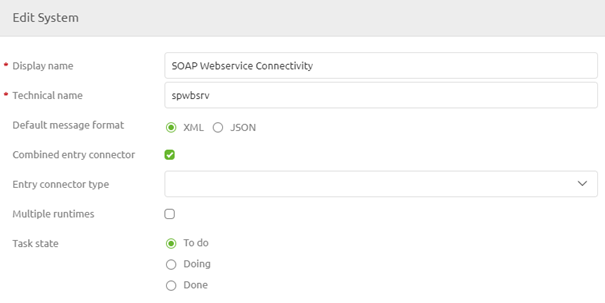
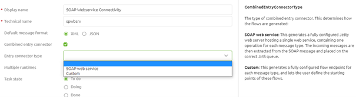
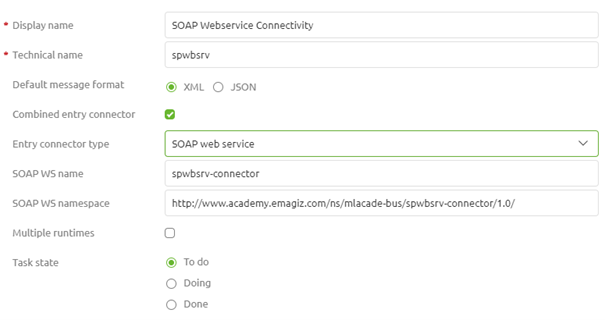
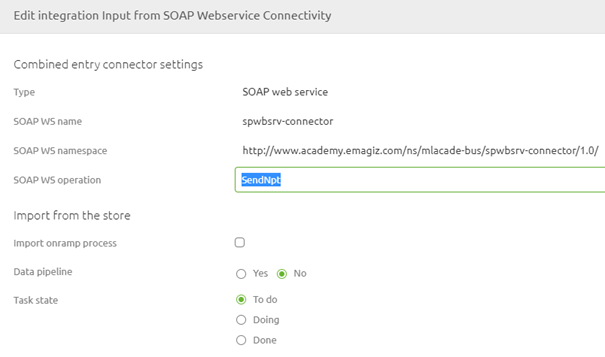

    

        <main class="micro-learning">
        <ul class="doc-nav">
            <li class="doc-nav__item"><a href="../../docs/microlearning/novice-soap-webservice-connectivity-index" class="doc-nav__link">Home</a></li>
            <li class="doc-nav__item"><a href="#intro" class="doc-nav__link">Intro</a></li>
            <li class="doc-nav__item"><a href="#theory" class="doc-nav__link">Theory</a></li>
            <li class="doc-nav__item"><a href="#practice" class="doc-nav__link">Practice</a></li>
            <li class="doc-nav__item"><a href="#solution" class="doc-nav__link">Solution</a></li>
        </ul>

##### Intro

# Configure your SOAP Webservice
 
When setting up a point at which your customers can talk to you eMagiz offers various methods of creating such a point. One of those options is by hosting a SOAP Webservice in eMagiz that handles XML messages asynchronously or synchronously. In this microlearning, we will learn the basics of this configuration in the various phases of the platform so you can easily set up your SOAP web service.

Should you have any questions, please contact academy@emagiz.com.

- Last update: June 10th, 2021
- Required reading time: 7 minutes

## 1. Prerequisites
- Basic knowledge of the eMagiz platform

## 2. Key concepts
This microlearning centers around configuring your SOAP web service.

By configuring, we mean: Designing and determining the characteristics of the SOAP web service

Crucial parts in the configuration are:
- Operation Name
- SOAP Webservice Namespace
- Validation
- Authentication

Of these four points, the last two will be discussed in separate microlearnings.

##### Theory
  
## 3. Configure your SOAP Webservice

When setting up a point at which your customers can talk to you eMagiz offers various methods of creating such a point. One of those options is by hosting a SOAP Webservice in eMagiz that handles XML messages asynchronously or synchronously. In this microlearning, we will learn the basics of this configuration in the various phases of the platform so you can easily set up your SOAP web service.

Crucial parts in the configuration are:
- Operation Name
- SOAP Webservice Namespace
- Validation
- Authentication

Of these four points, the last two will be discussed in separate microlearnings. In this microlearning, we will focus on the first two aspects of the configuration. As you might have noticed I did not mention the fact whether the integration is synchronous or asynchronous as a crucial part of the configuration. The reason being that when configuring a (SOAP) web service you always need to send an acknowledgment back to the client calling the web service to let them know what the status of the message is. In case you want to set up the rest of your integration asynchronously you can send an empty message back as acknowledgment. In case you want to set up the rest of your integration synchronously you need to send the response you have received from the backend operation back to the client. More on the choice between asynchronous and synchronous in a later stage.

### 3.1 Operation Name

Let us first zoom in on the parts of the configuration before we learn how you can implement it in eMagiz. Starting with the operation name. When you have dealt with the API Gateway offering of eMagiz in the past or have some knowledge of how APIs work the notion of an operation name should not be unfamiliar. In essence, it is a unique name that defines a certain operation. In eMagiz the best practice for naming the operation is as follows:

- Send{technicalnameoftheoperation}

When you are in Create you will notice that eMagiz uses the default suffix of Request and Response is added to the operation name. Therefore the full operation name a client needs to call to get the desired result if you adhere to the best practice is:

- Send{technicalnameoftheoperation}Request

### 3.2 SOAP Webservice Namespace

The second part of the configuration is the SOAP Webservice Namespace. When hosting a SOAP Webservice via the standard eMagiz tooling you need to define a namespace. To smoothen this process eMagiz automatically generates a namespace based on the configuration settings you choose in the Design phase of eMagiz.

### 3.3 Configuration in eMagiz

Now that we know what configurations are required, we can see how we can implement this in eMagiz. In the Capture phase, nothing changes. You simply draw a system on the canvas including at least one line that goes from the system towards eMagiz. When you are done you move to the Design phase in eMagiz. In this phase, you need to correctly set up the operation name(s) and the SOAP Webservice Namespace.

The configuration in Design starts at the system level. At the system level, you need to define the technical name (or let eMagiz automatically fill it in for you) and select the checkbox called Combined Entry Connector. By selecting this checkbox you tell eMagiz that you want to host an endpoint for others to call.

As you can see, selecting this option opens up a new choice to make. In this case between SOAP Webservice and Custom.

In this case, we opt for the SOAP web service. After you have done so eMagiz will automatically define the SOAP Webservice Name and SOAP Webservice Namespace.

With this, you are done with your configuration on the system level. Don't forget to update the status of your task. Now that we have configured the system it is time to configure the integration that is drawn from the system to eMagiz. We can do so by double-clicking on it (or by accessing the context menu and selecting the edit option). When you open the Edit page on the integration level you will notice that a new segment is added (compared to other integrations). This segment defines the settings on the system level we have just specified and defines the operation name.

As you can see eMagiz has already prefilled the operation name for you based on the best practice at eMagiz. If you want to change you have the option to do so. Do note that for the sake of consistency it would be smart to use the same naming convention within a single project to avoid confusion.

### 3.4 Add integration to Create

Now that we have finished the configuration in Design the last step of this microlearning is to add the integration to Create. You can simply do so by navigating to Create -> Add integrations and selecting the integration to move it to Create. After you have selected it press Save to add the integration to Create.

##### Practice

## 4. Assignment

Configure a SOAP web service that consists of at least one operation and add it to Create.
This assignment can be completed with the help of the (Academy) project that you have created/used in the previous assignment.

## 5. Key takeaways

- Crucial parts in the configuration are:
    - Operation Name
    - SOAP Webservice Namespace
    - Validation
    - Authentication
- For ease, you can use the default naming convention of eMagiz

##### Solution

## 6. Suggested Additional Readings

If you are interested in this topic and want more information on it please read the help text provided by eMagiz.

## 7. Silent demonstration video

<iframe width="1280" height="720" src="../../vid/microlearning/novice-soap-webservice-connectivity-configure-your-soap-webservice.mp4" frameborder="0" allow="accelerometer; autoplay; clipboard-write; encrypted-media; gyroscope; picture-in-picture" allowfullscreen></iframe>

</main>

