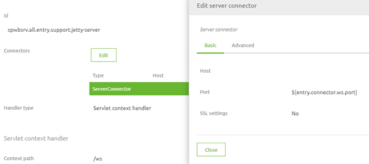
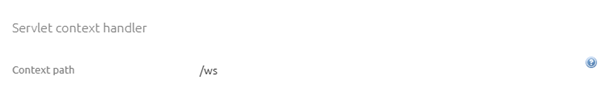
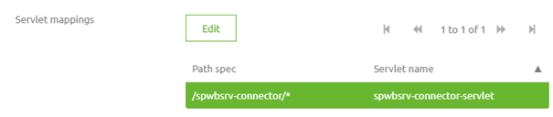
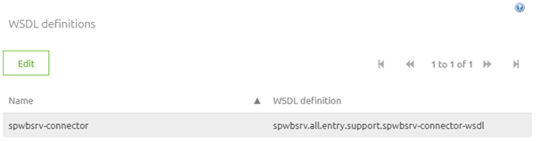

    

        <main class="micro-learning">
        <ul class="doc-nav">
            <li class="doc-nav__item"><a href="../../docs/microlearning/novice-soap-webservice-connectivity-index" class="doc-nav__link">Home</a></li>
            <li class="doc-nav__item"><a href="#intro" class="doc-nav__link">Intro</a></li>
            <li class="doc-nav__item"><a href="#theory" class="doc-nav__link">Theory</a></li>
            <li class="doc-nav__item"><a href="#practice" class="doc-nav__link">Practice</a></li>
            <li class="doc-nav__item"><a href="#solution" class="doc-nav__link">Solution</a></li>
        </ul>

##### Intro

# Endpoint Check
 
When setting up a point at which your customers can talk to you eMagiz offers various methods of creating such a point. One of those options is by hosting a SOAP Webservice in eMagiz that handles XML messages asynchronously or synchronously. One last check to perform before you can communicate with the external parties that the endpoint is available to receive messages and up and running. In this microlearning, we will learn how you can perform such a check.

Should you have any questions, please contact academy@emagiz.com.

- Last update: June 11th, 2021
- Required reading time: 7 minutes

## 1. Prerequisites
- Basic knowledge of the eMagiz platform

## 2. Key concepts
This microlearning centers around the endpoint check.

By endpoint check, we mean: determine whether the WSDL is accessible on the correct endpoint so we can forward the URL to the WSDL + the URL to call to our external parties

The endpoint consists of the following elements:
- Starts with https:// or http://
- Second part is the host (i.e. where is the endpoint running)
- Third part is the port on which the incoming traffic is accepted
- These three things combined make up the first part of our endpoint that will vary per environment
- Following that we have a static remainder of the endpoint that is build up as follows: /ws/{path-specific-servlet-mapping}/
- If you want to get to the WSDL simply add the name of the WSDL and the .wsdl extension to the endpoint when viewing it in the browser

##### Theory
  
## 3. Endpoint Check

hen setting up a point at which your customers can talk to you eMagiz offers various methods of creating such a point. One of those options is by hosting a SOAP Webservice in eMagiz that handles XML messages asynchronously or synchronously. One last check to perform before you can communicate with the external parties that the endpoint is available to receive messages and up and running. In this microlearning, we will learn how you can perform such a check.

The endpoint consists of the following elements:
- Starts with https:// or http://
- Second part is the host (i.e. where is the endpoint running)
- Third part is the port on which the incoming traffic is accepted
- These three things combined make up the first part of our endpoint that will vary per environment
- Following that we have a static remainder of the endpoint that is build up as follows: /{context-path}/{path-specific-servlet-mapping}/
- If you want to get to the WSDL simply add the name of the WSDL and the .wsdl extension to the endpoint when viewing it in the browser

As you can see the endpoint can be divided into two parts. One part is dynamic across environments and one part is static across environments. Let us first determine how we can find out the first part of our endpoint. 

### 3.1 HTTPS or HTTP

We start at the top with the determination of HTTPS or HTTP. A simple rule of thumb is that when running in the eMagiz Cloud the endpoint starts with https:// and when the endpoint is running locally (i.e. on-premise) the endpoint starts with http:// (unless you secure it yourself, more on that later).

### 3.2 Host

The next part of the endpoint is the host. The host is effectively the (virtual) machine on which the endpoint is running. When hosting an endpoint in the eMagiz cloud the host part is the combination between the DNS left-most label on Route level and the cloudslot on which your environment is running. The first part of the equation can be found under Deploy -> Architecture. The second part can be found under Deploy -> Properties by looking for the {technicalnameproject}.amqp01.host. You need to combine the two elements via a dash (-). An example of this would then be spwbsrv-test-cloud0001.emagizcloud.com. In case of an on-premise installation, you should ask your customer what the IP address or DNS name is to connect to the machine on which your runtime is running. If the runtime is running locally on your laptop the host equals localhost.

### 3.3 Port

Whether or not the port needs to be defined to get to the endpoint is once again determined by the location. If the endpoint is hosted in the eMagiz Cloud the port is *not* part of the endpoint. However, when you host your endpoint locally the endpoint becomes part of your endpoint. Note that to make this piece work in the eMagiz Cloud you should set up your Route properly. More on that in our Cloud Management courses. You can determine the port, for the endpoint or the route, in two steps. First, we navigate to the all entry we have created and open the Jetty component. The first segment of the Jetty Server talks about the server connector. In this part, the port is defined (either via a property or statically).

If it is defined via a property you can search for the corresponding value under Deploy -> Properties by checking on the property name and filtering on runtime level to get to the port. If it is defined statically you can simply read it here. Note that the best practice is to use a property value as that allows you to use a different range for your port numbering between environments. In other words, it allows you to use the 9000 range for Test, the 8000 range for Acceptance, and the 9000 range for Production. This is also to safeguard against someone accidentally sending data to the wrong environment.

### 3.3 Context Path

The first part of the static remainder of the endpoint is the context. By default, this is filled with /ws but you as a user can alter this. You can check the current value by opening the Jetty component again and looking at the context path that is filled in.

### 3.4 Path Specific Servlet Mapping

The last part of our endpoint is determined by the path-specific servlet mapping. You can once again find the value (and change it if you want to) within the Jetty component. In this component, you can see the servlet mappings and see the path that belongs to that servlet. For SOAP Webservice the best practice is to have only one servlet-mapping and in 99% of the cases, the auto-generated value of eMagiz is more than fine.

Combining all of this, assuming we run in the eMagiz Cloud, will result in the following endpoint for our Test environment:
- https://spwbsrv-test-cloud0001.emagizcloud.com/ws/spwbsrv-connector/

Combining all of this, assuming we run locally on our laptop, will result in the following endpoint for our Test environment:
- http://localhost:9091/ws/spwbsrv-connector/

### 3.5 Getting the WSDL name

To get to the WSDL to verify if it is available to be shared with external parties the last thing you need is the WSDL name. You can find this one, surprisingly enough, in the Jetty component. To get to the WSDL name double click on the servlet that is defined under the heading Servlets and navigate to the Advanced tab. Here you will see the name of the WSDL. If you have adhered to the default of eMagiz the name will mimic the name of your path-specific servlet mapping.

With this information we could reach the WSDL via the following endpoint, assuming we run in the eMagiz Cloud:
- https://spwbsrv-test-cloud0001.emagizcloud.com/ws/spwbsrv-connector/spwbsrv-connector.wsdl

With this information we could reach the WSDL via the following endpoint, assuming we run locally on our laptop:
- http://localhost:9091/ws/spwbsrv-connector/spwbsrv-connector.wsdl

With this information, you should be able to access the WSDL and communicate both the endpoint as well as the WSDL to your external parties.

##### Practice

## 4. Assignment

Determine the endpoint of your SOAP Webservice and retrieve the WSDL.
This assignment can be completed with the help of the (Academy) project that you have created/used in the previous assignment.

## 5. Key takeaways

- The endpoint consists of the following elements:
    - Starts with https:// or http://
    - Second part is the host (i.e. where is the endpoint running)
    - Third part is the port on which the incoming traffic is accepted
    - These three things combined make up the first part of our endpoint that will vary per environment
    - Following that we have a static remainder of the endpoint that is build up as follows: /{context-path}/{path-specific-servlet-mapping}/
    - If you want to get to the WSDL simply add the name of the WSDL and the .wsdl extension to the endpoint when viewing it in the browser
- The relevant information can be derived from the Jetty component and by determining where the endpoint is hosted

##### Solution

## 6. Suggested Additional Readings

If you are interested in this topic and want more information on it please read the help text provided by eMagiz.

## 7. Silent demonstration video

<iframe width="1280" height="720" src="../../vid/microlearning/novice-soap-webservice-connectivity-endpoint-check.mp4" frameborder="0" allow="accelerometer; autoplay; clipboard-write; encrypted-media; gyroscope; picture-in-picture" allowfullscreen></iframe>

</main>

