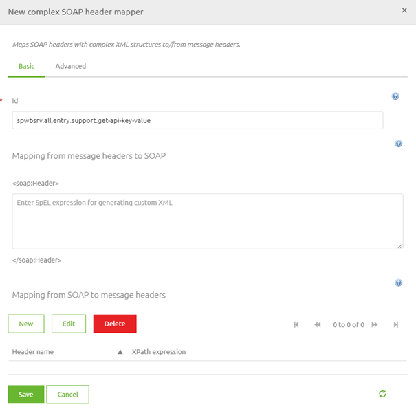
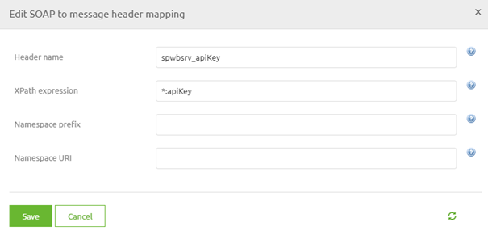
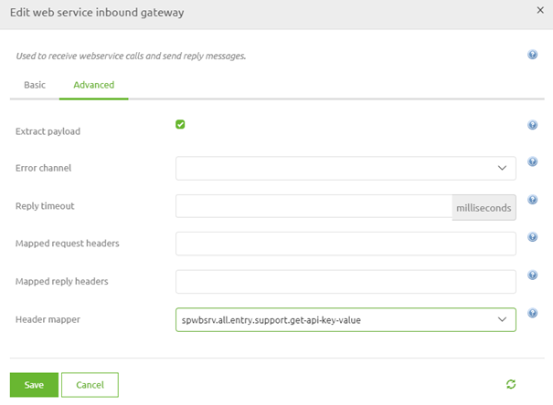
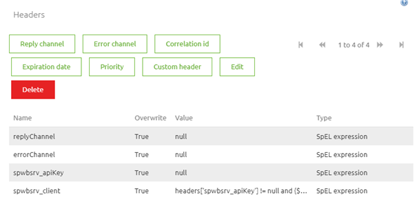
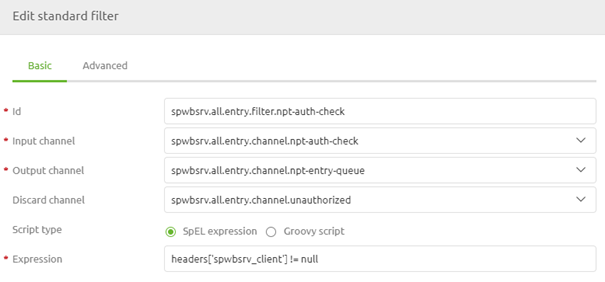
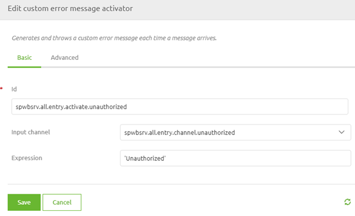

    

        <main class="micro-learning">
        <ul class="doc-nav">
            <li class="doc-nav__item"><a href="../../docs/microlearning/novice-soap-webservice-connectivity-index" class="doc-nav__link">Home</a></li>
            <li class="doc-nav__item"><a href="#intro" class="doc-nav__link">Intro</a></li>
            <li class="doc-nav__item"><a href="#theory" class="doc-nav__link">Theory</a></li>
            <li class="doc-nav__item"><a href="#practice" class="doc-nav__link">Practice</a></li>
            <li class="doc-nav__item"><a href="#solution" class="doc-nav__link">Solution</a></li>
        </ul>

##### Intro

# Securing your SOAP Webservice
 
When setting up a point at which your customers can talk to you eMagiz offers various methods of creating such a point. One of those options is by hosting a SOAP Webservice in eMagiz that handles XML messages asynchronously or synchronously. In this microlearning, we will zoom in on the part that security plays on a client level when hosting a SOAP webservice.

Should you have any questions, please contact academy@emagiz.com.

- Last update: June 10th, 2021
- Required reading time: 7 minutes

## 1. Prerequisites
- Basic knowledge of the eMagiz platform

## 2. Key concepts
This microlearning centers around configuring your SOAP web service.

By configuring, we mean: Designing and determining the characteristics of the SOAP web service

Crucial parts in the configuration are:
- Operation Name
- SOAP Webservice Namespace
- Validation
- Authentication

Of these four points, we will zoom in on the authentication part of our SOAP Webservice in this microlearning.

##### Theory
  
## 3. Securing your SOAP Webservice

When setting up a point at which your customers can talk to you eMagiz offers various methods of creating such a point. One of those options is by hosting a SOAP Webservice in eMagiz that handles XML messages asynchronously or synchronously. In this microlearning, we will zoom in on the part that security plays on a client level when hosting a SOAP webservice.

Crucial parts in the configuration are:
- Operation Name
- SOAP Webservice Namespace
- Validation
- Authentication

Of these four points, we will zoom in on the authentication part of our SOAP Webservice in this microlearning. When hosting your SOAP web service in the eMagiz Cloud the endpoint will be https secured on default. If you want to mimic the same result for an on-premise environment you should define the valid SSL settings (https://my.emagiz.com/p/question/172825635700357186). 

Apart from that aspect of security we should also consider how clients that call the SOAP Web service will authenticate themselves upon entry. Within eMagiz we advise a two step approach. Each client that wants to call your SOAP Webservice should:

- Send along a client certificate
- Send along an api key in an SOAP Header that references to the word apiKey (i.e. apiKey)

To verify both parts some configuration is needed. The first aspect, checking for a valid client certificate is done on cloud level. For more information on how to exactly configure this please take a look at the microlearning [Securing a hosted web service with certificates in the eMagiz Cloud](intermediate-securing-your-data-traffic-securing-a-hosted-webservice-with-certificates-in-the-emagiz-cloud.md).

In this microlearning we will focus on the second part of the configuration.

### 3.1 API Key verification

To verify whether the client has send a valid API Key we need to change the configuration within the entry flow in the Create phase of eMagiz. The configuration consists of three steps:

- Get value from SOAP Header
- Check value against list
- Respond based on results

#### 3.1.1 Get value from SOAP Header

Let us move to the entry flow by going to the Create phase of eMagiz, opening the correct flow and entering "Start Editing" mode. After you have done so we need to add a support object to the flow. The support we need is called Complex SOAP header mapper. In this component we need the bottom section.

In here we define a new header by entering a name and a valid XPath expression.

When you are satisfied you can press Save twice to store the support object. After we have configured the support object we need to link it to our web service inbound gateway. To do so open the component, navigate to the advanced tab and select the Header mapper you have just created.

#### 3.1.2 Check value against list

Now that we placed the value the client has entered in the apiKey SOAP header on our message we can check whether the value exists in a list of predefined valid values. To do add two headers to the standard header enricher component in your flow. The first one ensures that the apiKey is removed from the header (to prevent the apiKey from being publicly seen by others). The second one searches for the client name that corresponds with the apiKey and returns the name of the client in the header. This search action is done with the help of a SpEL expression, more on that later on. In this case the SpEL expression we use is set up as follows: headers['spwbsrv_apiKey'] != null and {${authentication.api-keys}}.contains(headers.spwbsrv_apiKey) ? {${authentication.tenant-ids}}[{${authentication.api-keys}}.indexOf(headers.spwbsrv_apiKey)] : null

With this SpEL expression we check whether there is an apiKey and whether that apiKey can be found in a predefined list. If so we search for the corresponding name based on the index of where a certain apiKey is within the list. If not the header is not created. Combining this logic in one component should look similar to the following.

#### 3.1.3 Respond based on results

After we have searched for the apiKey in the list and we have defined the client that is sending the information (or not) we can respond to the client whether or not the client is authorized to call our SOAP webservice. To execute this check we first need a standard filter component. In this component we will check whether the spwbsrv_client header we have just created is not null. 

If it is indeed not null we can pass the empty message back to the client telling the client that the message was delivered successfully. If the header is null we need to tell the client that he/she is unauthorized to call the operation. To do so we need to add a component called custom error message activator. In this component we define the message we want to give back to the client in case of the error. In this case we simply give back 'Unauthorized'.

With all this done we have succesfully secured our SOAP web service according to the best practices.

##### Practice

## 4. Assignment

Secure a SOAP web service confirm the outlined approach above. Focus on the apiKey part.
This assignment can be completed with the help of the (Academy) project that you have created/used in the previous assignment.

## 5. Key takeaways

- Crucial parts in the configuration are:
    - Operation Name
    - SOAP Webservice Namespace
    - Validation
    - Authentication
- Hosting your SOAP webservice in the eMagiz cloud results in standard https
- Use a combination of client certificate + apiKey for authentication

##### Solution

## 6. Suggested Additional Readings

If you are interested in this topic and want more information on it please read the help text provided by eMagiz.

## 7. Silent demonstration video

<iframe width="1280" height="720" src="../../vid/microlearning/novice-soap-webservice-connectivity-securing-your-soap-webservice.mp4" frameborder="0" allow="accelerometer; autoplay; clipboard-write; encrypted-media; gyroscope; picture-in-picture" allowfullscreen></iframe>

</main>

