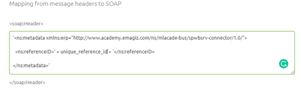

    

        <main class="micro-learning">
        <ul class="doc-nav">
            <li class="doc-nav__item"><a href="../../docs/microlearning/novice-soap-webservice-connectivity-index" class="doc-nav__link">Home</a></li>
            <li class="doc-nav__item"><a href="#intro" class="doc-nav__link">Intro</a></li>
            <li class="doc-nav__item"><a href="#theory" class="doc-nav__link">Theory</a></li>
            <li class="doc-nav__item"><a href="#practice" class="doc-nav__link">Practice</a></li>
            <li class="doc-nav__item"><a href="#solution" class="doc-nav__link">Solution</a></li>
        </ul>

##### Intro

# SOAP Headers
 
When communicating via SOAP webservice calls it can happen that an exchange of data needs to happen between the message headers on your message and the SOAP headers. In this microlearning, we will learn about this exchange in both directions. SOAP Headers are headers within a SOAP Envelope that can be used to communicate metadata or authentication information between parties.

Should you have any questions, please contact academy@emagiz.com.

- Last update: June 10th, 2021
- Required reading time: 5 minutes

## 1. Prerequisites
- Basic knowledge of the eMagiz platform

## 2. Key concepts
This microlearning centers around SOAP Headers.

By SOAP Headers, we mean: headers within a SOAP Envelope that can be used to communicate metadata or authentication information between parties

You can exchange data from:
- SOAP Header to Message Header
- Message Header to SOAP Header

In both cases ensure that the correct information is exchanged.

##### Theory
  
## 3. SOAP Headers

When communicating via SOAP webservice calls it can happen that an exchange of data needs to happen between the message headers on your message and the SOAP headers. In this microlearning, we will learn about this exchange in both directions. SOAP Headers are headers within a SOAP Envelope that can be used to communicate metadata or authentication information between parties.

You can exchange data from:
- SOAP Header to Message Header
- Message Header to SOAP Header

In both cases ensure that the correct information is exchanged.

In a previous microlearning we already discussed one aspect of this. As you probably recall from our microlearning on [Securing your SOAP Webservice](novice-soap-webservice-connectivity-securing-your-soap-webservice.md) we needed to exchange data between the SOAP header that our client was sending and a message header on the message so we could check whether or not the client was authorized to call the operation.

In that microlearning we also discussed the component that we need for this. The 'complex SOAP header mapper'.

As you can see you can map from and to message headers with regards to the SOAP Headers. As we already discussed the first scenario in an earlier microlearning I will for now continue with the other scenario. This scneario is mainly needed when eMagiz calls a SOAP web service that is hosted by an external party. Since we would normaly do this in an exit (gate/flow) let us open such an exit in eMagiz and enter "Start Editing" mode.

The first step we need to take is to ensure that the information that we need to send to the SOAP web service in question (in this a unique reference number) is available in a message header. This can be done by verifying in all steps that preceded before the message entered the exit whether or not this piece of information was already added to a message header. In this case we assume that this is the case since we want to focus on the 'complex SOAP header mapper' component and its relation to the webservice outbound gateway. To correctly exchange data from a message header to a SOAP header we need to define a valid SpEL expression. See the help text of the component for a suggestion of what a valid SpEL expression is. Key part in this is knowing how the external party wants to receive the header(s) and how you (or one of your colleagues) has named the message header. When you have those two information elements you can write the correct expression. The result should be something as follows:

Once you are satisfied you can press Save and link the support object to the web service outbound gateway.

With this information you can place SOAP Headers on message headers and vice versa everytime you need it.

##### Practice

## 4. Assignment

Call an external web service and send along some SOAP Headers.
This assignment can be completed with the help of the (Academy) project that you have created/used in the previous assignment.

## 5. Key takeaways

- You can exchange data from:
    - SOAP Header to Message Header
    - Message Header to SOAP Header
- You need the SOAP structure and the message header name to make it work

##### Solution

## 6. Suggested Additional Readings

If you are interested in this topic and want more information on it please read the help text provided by eMagiz.

## 7. Silent demonstration video

<iframe width="1280" height="720" src="../../vid/microlearning/novice-soap-webservice-connectivity-soap-headers.mp4" frameborder="0" allow="accelerometer; autoplay; clipboard-write; encrypted-media; gyroscope; picture-in-picture" allowfullscreen></iframe>

</main>

