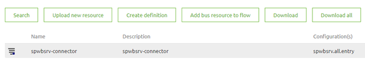
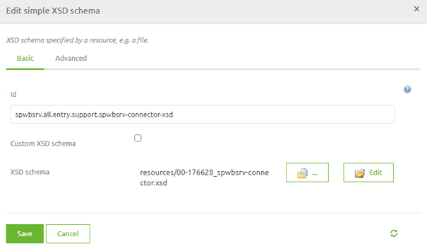

    

        <main class="micro-learning">
        <ul class="doc-nav">
            <li class="doc-nav__item"><a href="../../docs/microlearning/novice-soap-webservice-connectivity-index" class="doc-nav__link">Home</a></li>
            <li class="doc-nav__item"><a href="#intro" class="doc-nav__link">Intro</a></li>
            <li class="doc-nav__item"><a href="#theory" class="doc-nav__link">Theory</a></li>
            <li class="doc-nav__item"><a href="#practice" class="doc-nav__link">Practice</a></li>
            <li class="doc-nav__item"><a href="#solution" class="doc-nav__link">Solution</a></li>
        </ul>

##### Intro

# Validate Incoming Messages
 
When setting up a point at which your customers can talk to you eMagiz offers various methods of creating such a point. One of those options is by hosting a SOAP Webservice in eMagiz that handles XML messages asynchronously or synchronously. In this microlearning, we will zoom in on the part that validation of the messages plays when offering such a SOAP web service.

Should you have any questions, please contact academy@emagiz.com.

- Last update: June 10th, 2021
- Required reading time: 7 minutes

## 1. Prerequisites
- Basic knowledge of the eMagiz platform

## 2. Key concepts
This microlearning centers around configuring your SOAP web service.

By configuring, we mean: Designing and determining the characteristics of the SOAP web service

Crucial parts in the configuration are:
- Operation Name
- SOAP Webservice Namespace
- Validation
- Authentication

Of these four points, we will zoom in on the validation part of our SOAP Webservice in this microlearning.

##### Theory
  
## 3. Validate Incoming Messages

When setting up a point at which your customers can talk to you eMagiz offers various methods of creating such a point. One of those options is by hosting a SOAP Webservice in eMagiz that handles XML messages asynchronously or synchronously. In this microlearning, we will zoom in on the part that validation of the messages plays when offering such a SOAP web service.

Crucial parts in the configuration are:
- Operation Name
- SOAP Webservice Namespace
- Validation
- Authentication

Of these four points, we will zoom in on the validation part of our SOAP Webservice in this microlearning. The SOAP Webservice serves as a point of entry where people with the rights credentials (security) and the right answers (validation) are allowed to enter and perform their actions. In the next microlearning, we will talk about the security part. In this microlearning, we talk about the validation part.

As you have learned from the crash course you can validate an XML message with the help of an XSD. This XSD describes dataTypes, order, associations, and length of attributes. You can use such an XSD for the validation of what your clients send you. eMagiz will automatically define a WSDL based on the XSD that you provide that stores metainformation and stores the XSD for validation purposes. This way you can communicate the WSDL (location) to external parties as a reference document upon which they can build their solution. If you keep the eMagiz defaults you can access the WSDL via http://host:port/ws/ws-name/ws-name.wsdl. Note that you need to all values (except for the ws and .wsdl part) with actual values.

What eMagiz does need from you is the correct XSD for validation. As a starting point you should download the XSD that eMagiz has generated based on the system message(s) you have defined in the Design phase. Once you have that you can structure the XSD correctly. A valid XSD start with a schema segment. In this segment you need to define your SOAP WS namespace:

<?xml version="1.0" encoding="UTF-8" standalone="yes"?>
<xs:schema xmlns:xs="http://www.w3.org/2001/XMLSchema"
    xmlns="http://www.academy.emagiz.com/ns/mlacade-bus/spwbsrv-connector/1.0/"
    attributeFormDefault="unqualified" elementFormDefault="unqualified"
    targetNamespace="http://www.academy.emagiz.com/ns/mlacade-bus/spwbsrv-connector/1.0/">

Once you have that you need to copy all complex and simple types from the XSD that you downloaded and paste them below the lines you have created:

<xs:complexType name="Input">
        <xs:sequence>
            <xs:element name="String" type="nonEmptyString"/>
            <xs:element minOccurs="0" name="Decimal" type="xs:decimal"/>
            <xs:element name="Enum" type="Enum"/>
            <xs:element name="Integer" type="xs:long"/>
            <xs:element name="Boolean" type="xs:boolean"/>
            <xs:element minOccurs="0" name="DateTime" type="xs:dateTime"/>
        </xs:sequence>
    </xs:complexType>
    <xs:simpleType name="nonEmptyString">
        <xs:restriction base="xs:string">
            <xs:minLength value="1"/>
        </xs:restriction>
    </xs:simpleType>
    <xs:simpleType name="Enum">
        <xs:restriction base="xs:string">
            <xs:enumeration value="URGENT"/>
            <xs:enumeration value="HIGH"/>
            <xs:enumeration value="MEDIUM"/>
            <xs:enumeration value="LOW"/>
            <xs:enumeration value="PLANNING"/>
        </xs:restriction>
    </xs:simpleType>

To wrap things up you need to define your Request and Response element and close the schema:

<xs:element name="SendNptRequest">
        <xs:complexType>
            <xs:sequence>
                <xs:element name="Input" type="Input"/>
            </xs:sequence>
        </xs:complexType>
    </xs:element>   
    <xs:element name="SendNptResponse">
        <xs:complexType/>
    </xs:element>
    </xs:schema>

Combining this will result in a valid XSD for my example. In your case, you will need to enter other values. When you are done with the creation of the XSD save it with a name such as spwbsrv-connector.xsd and upload it to the flow. After you have uploaded the XSD link it to the connector-xsd support object in your entry.

With this done you have successfully added validation to your SOAP web service.

##### Practice

## 4. Assignment

Add validation to the SOAP Webservice we have been configuring.
This assignment can be completed with the help of the (Academy) project that you have created/used in the previous assignment.

## 5. Key takeaways

- Crucial parts in the configuration are:
    - Operation Name
    - SOAP Webservice Namespace
    - Validation
    - Authentication
- Validation is done with the help of an XSD
- The WSDL is used for external documentation
- Use the XSD generated by eMagiz based on the system message as a starting point

##### Solution

## 6. Suggested Additional Readings

If you are interested in this topic and want more information on it please read the help text provided by eMagiz.

## 7. Silent demonstration video

<iframe width="1280" height="720" src="../../vid/microlearning/novice-soap-webservice-connectivity-validate-incoming-messages.mp4" frameborder="0" allow="accelerometer; autoplay; clipboard-write; encrypted-media; gyroscope; picture-in-picture" allowfullscreen></iframe>

</main>

