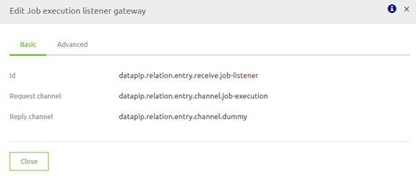
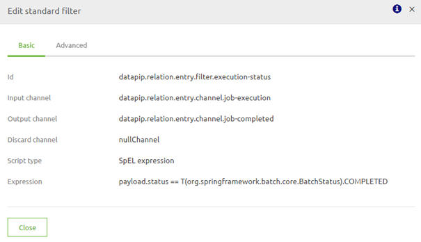
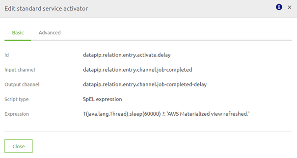
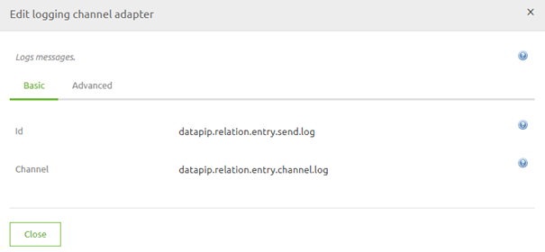
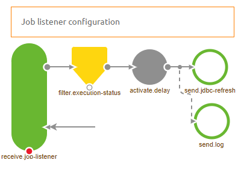
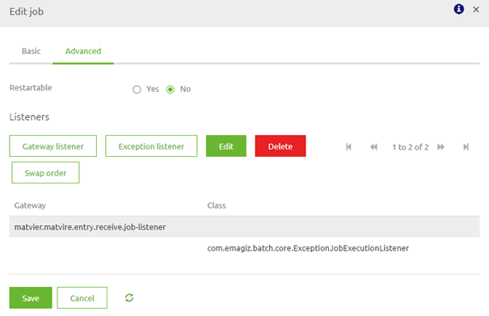
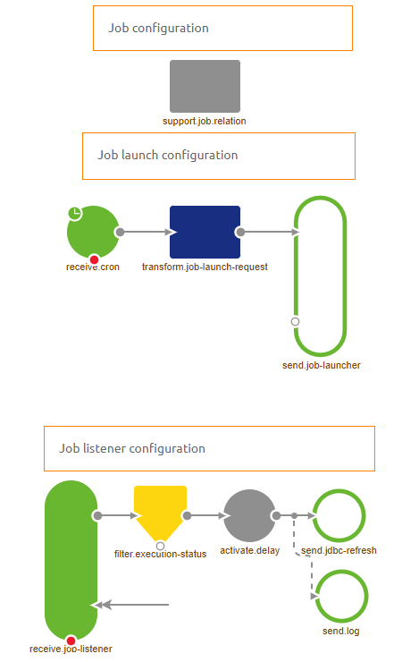

    

        <main class="micro-learning">
        <ul class="doc-nav">
            <li class="doc-nav__item"><a href="../../docs/migrationpath/index_academy_migrationpath_all" class="doc-nav__link">Home</a></li>
            <li class="doc-nav__item"><a href="#intro" class="doc-nav__link">Intro</a></li>
            <li class="doc-nav__item"><a href="#theory" class="doc-nav__link">Theory</a></li>
            <li class="doc-nav__item"><a href="#practice" class="doc-nav__link">Practice</a></li>
            <li class="doc-nav__item"><a href="#solution" class="doc-nav__link">Solution</a></li>
        </ul>

##### Intro

## Migration Path - AWS Redshift Refresh

Below you will find a document describing the migration path to add the AWS Redshift Refresh functionality to a data pipeline solution you have previously built.
If you want to implement a new data pipeline, import it from the store, guaranteeing that this functionality will be included.

Should you have any questions, please get in touch with academy@emagiz.com.

- Last update: March 1st, 2022
- Required reading time: 6 minutes

## 1. Prerequisites
- Basic knowledge of the eMagiz platform
- Understanding of Data pipelining concepts
- A existing Data pipeline solution within your eMagiz project.

## 2. Key concepts

- This functionality automatically refreshes the materialized view in Redshift
- By making eMagiz refresh it automatically, the data in your dashboards are kept up to date

##### Theory

## 3. Migration Path - Root Cloud to eMagiz Cloud

Below you will find a document describing the migration path to add the AWS Redshift Refresh functionality to a data pipeline solution you have previously built.
If you want to implement a new data pipeline, import it from the store, guaranteeing that this functionality will be included.

### 3.1 Remove unnecessary components

First, we will delete components that have become obsolete as of late. The parts you can remove from the flow are:

- support.bus-connection-plain
- support.bus-connection-caching

Furthermore, you could remove the following debug components as every interesting step is already monitored and can therefore be tracked without the help of the debugger:

- global channel interceptor
- activate.debug-bridge
- send.debug
- entry.channel.debug-queue
- debugBridgeChannel

### 3.2 Add new components to refresh AWS Redshift
AWS Redshift offers you the option to create a materialized view. A materialized view is a table that combines information from several source tables into one view.
To keep updating this materialized view when a source table is updated eMagiz has created functionality to refresh the materialized view.

To make sure that your existing data pipeline will function in the same way you should execute the following steps:
- Add a channel called job-execution
- Add a channel called dummy
- Add a channel called job-completed
- Add a channel called job-completed-delay
- Add a channel called log
- Add a job execution listener gateway and configure it as follows
    

- Add a standard filter and configure it as follows (the expression checks whether the Job is already finished) -> payload.status == T(org.springframework.batch.core.BatchStatus).COMPLETED
    

- Add a standard activator and configure it as follows (the expression puts the thread to sleep for 60 seconds) -> T(java.lang.Thread).sleep(60000) ?: 'AWS Materialized view refreshed.'
    

- Add a JDBC outbound channel adapter and configure it as follows (query can be found below)
    

- Add a logging channel adapter and configure it as follows
    

- Make sure that the job-completed-delay channel is wiretapped with the help of the log channel 

### 3.3 Query you need for refresh

The following query is needed to refresh the AWS materialized view. First, make sure that the name of the materialized view is filled in as a property value.
    
REFRESH MATERIALIZED VIEW ${dp.jdbc.distinctive-name.tablename}_mv;
COMMIT; 
    
### 3.4 Intermediate Result

The result should look something like this:

### 3.5 Add listener to job
If you only add the listener section in the flow, you would have a solution that only partly works. 
To make sure the complete chain of events starts working in unison, you need to tell the job which listeners need to listen to the execution of the job.

To do so, open the component called support. job.{technicalnameofmessagetype}. On the advanced tab, you need to add two listeners:

- A Gateway Listener -> Select the job execution listener that you have added in step 2
- A Exception Listener -> This one makes sure that when an error occurs in AWS Redshift, the job status will be Failed instead of Completed.

The configuration should look as follows:

### 3.6 End Result

The result of all this should look something like this:

p align="center">

##### Practice

## 4. Key takeaways

- This functionality automatically refreshes the materialized view in Redshift
- By making eMagiz refresh it automatically, the data in your dashboards are kept up to date

</main>

