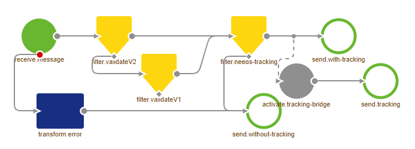
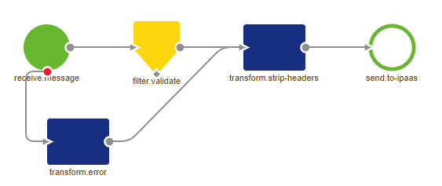

    

        <main class="micro-learning">
        <ul class="doc-nav">
            <li class="doc-nav__item"><a href="../../docs/migrationpath/index_academy_migrationpath_all" class="doc-nav__link">Home</a></li>
            <li class="doc-nav__item"><a href="#intro" class="doc-nav__link">Intro</a></li>
            <li class="doc-nav__item"><a href="#theory" class="doc-nav__link">Theory</a></li>
            <li class="doc-nav__item"><a href="#practice" class="doc-nav__link">Practice</a></li>
            <li class="doc-nav__item"><a href="#solution" class="doc-nav__link">Solution</a></li>
        </ul>

##### Intro

# Migration Path - Error flow

The error flow is part of the default in any eMagiz project. This flow handles all errors that are thrown by (a)synchronous flows within your project and passes them through to the iPaaS, so they show up under Manage -> Error Messages. Recently we have made some changes to make the error flow work even more optimal.

Should you have any questions, please get in touch with academy@emagiz.com.

- Last update: March 1st, 2022
- Required reading time: 4 minutes

## 1. Prerequisites
- Basic knowledge of the eMagiz platform

## 2. Key concepts
- The error flow is updated to make it more robust in handling unexpectedly large errors

##### Theory

## 3. Migration Path - Error flow

The error flow is part of the default in any eMagiz project. This flow handles all errors that are thrown by (a)synchronous flows within your project and passes them through to the iPaaS, so they show up under Manage -> Error Messages. Recently we have made some changes to make the error flow work even more optimal.

### 3.1 Legacy approach

In the legacy situation, the flow would determine whether or not message tracking was enabled for each message. Based on that, the error handling responded in a slightly different manner.

### 3.2 New approach

In the new situation, the flow treats all messages the same and removes all headers to reduce the chance the error message will cause problems downstream for the iPaaS or the portal.

### 3.3 How to get to the new approach

Migrating from the old to the new error flow takes several steps to make it work correctly. Below you will find all these steps. Follow them carefully to achieve the desired result.
1. Determine if you made any custom changes to the error handling
-   If yes, continue with step 2
-   If not, continue with step 4
2. Determine if these changes are still justified
-   If not, continue with step 4
-   If yes, continue with step 3
3. Write down all manual changes you still need    
4. Navigate to Create
5. Right-click on the Error process and press Reset flow
6. Add the manual changes back to the flow (if there are any manual changes)
7. Test the flow
8. Verify your results
-   If the result is the same, you are finished
-   If changes exist, analyze them and make changes where necessary
Congratulations, you have successfully migrated the error flow to the new setup

##### Practice

## 4. Key takeaways

- The error flow is updated to make it more robust in handling unexpectedly large errors

</main>

