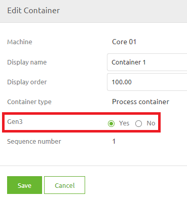
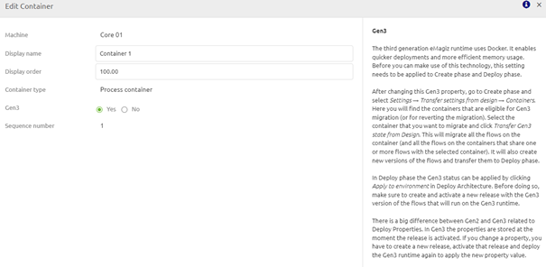
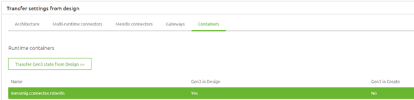
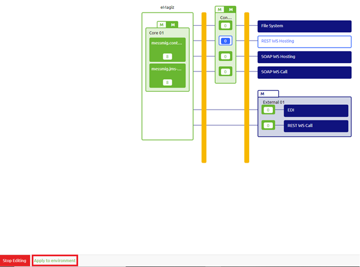
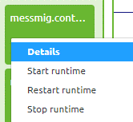
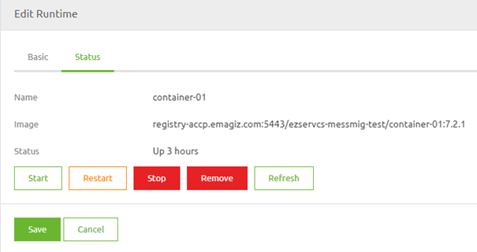
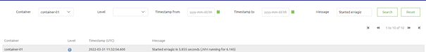
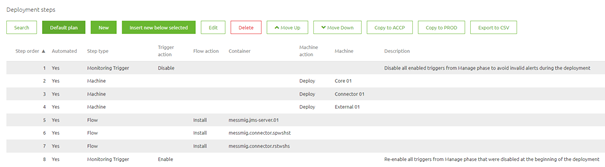

    

        <main class="micro-learning">
        <ul class="doc-nav">
            <li class="doc-nav__item"><a href="../../docs/migrationpath/index_academy_migrationpath_all" class="doc-nav__link">Home</a></li>
            <li class="doc-nav__item"><a href="#intro" class="doc-nav__link">Intro</a></li>
            <li class="doc-nav__item"><a href="#theory" class="doc-nav__link">Theory</a></li>
            <li class="doc-nav__item"><a href="#practice" class="doc-nav__link">Practice</a></li>
            <li class="doc-nav__item"><a href="#solution" class="doc-nav__link">Solution</a></li>
        </ul>

##### Intro

# Migration Path - eMagiz Runtime Generation 3

Below you will find a document describing the migration path to migrate a single runtime (i.e., connector or container) to the latest generation runtime. Note that this functionality is not yet generally available and can only be executed after consulting your partner manager. For the key aspects of the new generation compared to the current generation please read [eMagiz Runtime Generation 3](../fundamental/fundamental-runtime-generation3.md). 

Should you have any questions, please get in touch with academy@emagiz.com.

- Last update: March 31st, 2022
- Required reading time: 6 minutes

## 1. Prerequisites
- Advanced knowledge of the eMagiz platform
- A thorough understanding of your eMagiz model

## 2. Key concepts

- This migration path allows you to migrate a specific runtime to Generation 3
- All flows of the runtime are updated, so plan your migration
- The JMS needs to be migrated to Generation 3 as the last runtime of your model
- When executing the first migration of a runtime, additional steps are necessary to update your cloud configuration
- In case you want to use the new EDI functionality in messaging, both the connector and the process container need to be migrated to Generation 3

##### Theory

## 3. Migration Path - eMagiz Runtime Generation 3

Below you will find a document describing the migration path to migrate a single runtime (i.e., connector or container) to the latest generation runtime. Note that this functionality is not yet generally available and can only be executed after consulting your partner manager. For the key aspects of the new generation compared to the current generation please read [eMagiz Runtime Generation 3](../fundamental/fundamental-runtime-generation3.md).

### 3.1 Known Limitations

We are currenlty working hard to support as many model components as possible. However as the development of generation 3 on multiple parts of our architecture is still ongoing not everything will work in generation 3 compared to the current runtime architecture. Please keep this known limiations in mind when considering a migration of a runtime to generation 3.

| Limitation | Impacted Part | Expected Resolve Date | 
| :---: | :----: | :----: |
| Need to execute "Apply to environment" twice | eMagiz Portal | July 2022 |
| Progress Bar when making release active | eMagiz Portal | To be determined |
| Not enough memory configured to run can block you | eMagiz Portal | To be determined |
| Seeing Error Messages in the iPaaS Portal | eMagiz Portal | Q3 2022 |
| Manage phase (statistics, alerts, notifications, daily data limits) | eMagiz Portal | Q3 2022 |
| Message Redelivery | eMagiz Portal and Runtime | To be determined |
| Code Mappings | eMagiz Portal and Runtime | To be determined |
| Smooks components | Container | To be determined |
| XSL-FO (PDF Generation) | Container | To be determined |
| Hosting a SOAP web service | Connector | To be determined |
| Hosting a REST web service | Connector | To be determined |
| Hosting an ODATA web service | Connector | To be determined |
| Using "Batch" components (i.e. Data Pipeline) | Connector | To be determined |
| WS-Security (Both Client and Server side) | Connector | To be determined |

### 3.2 Update Design Architecture

The first step of this migration path is to update a part of your Design Architecture. In this update step, you will define on runtime level (i.e., connector or container) whether a runtime is a generation 3 runtime or not.

Note that we have provided an extensive help text to support you in your choice of whether to migrate to Generation 3 or not. You can read the help text by pressing the information icon on the popup and selecting the Gen3 option.

### 3.3 Transfer Settings from Design

Now that we have indicated that a certain runtime needs to be migrated to Generation three, the next step is Create. In Create navigate to Settings -> Transfer Settings From Design -> Container. Here you will see all runtimes designed to be generation 3 in Design but are still configured as generation 2 in Create. 

When you press the button "Transfer Gen3 state from Design", eMagiz will automatically migrate your environment to the latest generation and update all your flows accordingly. This means that each flow will get a new version number which we need to deploy in a later phase.

### 3.4 Create a new release

After the migration is finished, eMagiz will have created new versions of all flows on the runtime you just migrated. The next step would be to include these changes in a new release so they can be deployed. After adding the new flow versions to the release, ensure the release is "set as active."

### 3.5 Update Deploy Architecture

#### 3.5.1 Update Cloud Template - One Time Action

For the first runtime, you migrate to Generation 3; you need to ensure that the correct cloud template is selected on which the Generation 3 runtimes can function. This is the latest Docker template available at the moment of your migration. Note that upgrades of new cloud templates will be automated after this moment, just as you are used to within eMagiz. As an alternative, you can also execute the updates manually if needed.

To update your cloud architecture, press "Apply to Environment" in Deploy Architecture. Note that you need to be in "Start Editing" mode to execute this command.

#### 3.5.2 Update A Subsequent Runtime

Apart from updating the cloud template itself, you also need to update each subsequent runtime so it will run on Generation 3. Note that this update will be included the first time when you update the cloud template. To apply the changes from Design Architecture to Deploy Architecture, you need to press the button "Apply to Environment" just as you would now if you add or change a runtime in the current architecture. 

### 3.6 Verify whether runtime started

There are two mechanisms to verify whether the runtime started up correctly. Below you can find more information on these mechanisms. 

#### 3.6.1 Verification in Deploy Architecture

The first check can be done in Deploy Architecture itself. Here you can access the context menu on the runtime level and open the Details page of the runtime.

Once you have opened the Details overview, you will see a second tab called "Status". On this tab, you can see the "Status" of the runtime and execute several commands on the runtime level when in "Start Editing" mode.

You can also define which release version is running on this runtime by looking at the last part of the image name. This part holds a reference to the release version. In this example, the release version is 7.2.1

#### 3.6.2 Verification in Manage

On top of this verification, you can check the Log Entries in Manage to see whether your runtime successfully started up. Here you can search for the key phrase "Started eMagiz" to see which runtimes have been started (or you can filter on a specific runtime).

### 3.7 Update Deployment Plan

Note that the way each runtime is deployed is changed in Generation 3. This also means that your deployment plan changes as well. For example, instead of deploying on a flow-by-flow basis, we will package the whole runtime in one image and deploy that to the machine. Therefore new steps have been added to the deployment plan to deploy changes on your machine. For example, the first time you introduce a Generation 3 runtime on a machine, you need to add a Deploy Machine step to the deployment plan and remove all actions referencing the runtime you just migrated. An example of what this looks like can be seen below.

##### Practice

## 4. Key takeaways

- This migration path allows you to migrate a specific runtime to Generation 3
- All flows of the runtime are updated, so plan your migration
- The JMS needs to be migrated to Generation 3 as the last runtime of your model
- When executing the first migration of a runtime, additional steps are necessary to update your cloud configuration
- In case you want to use the new EDI functionality in messaging, both the connector and the process container need to be migrated to Generation 3

</main>

