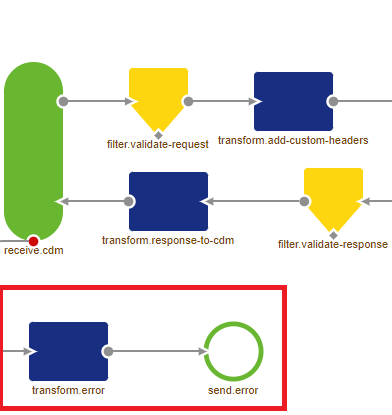
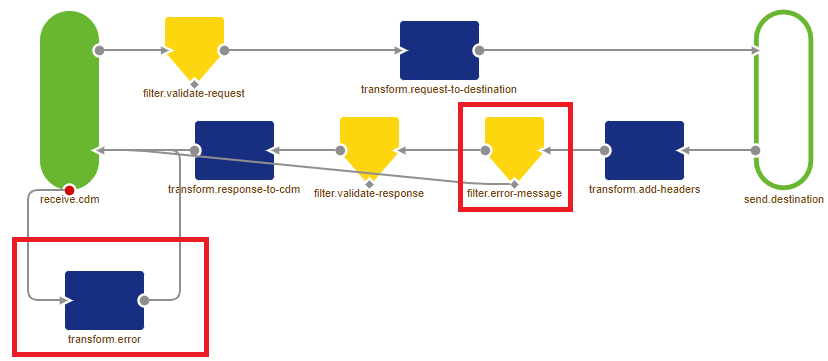
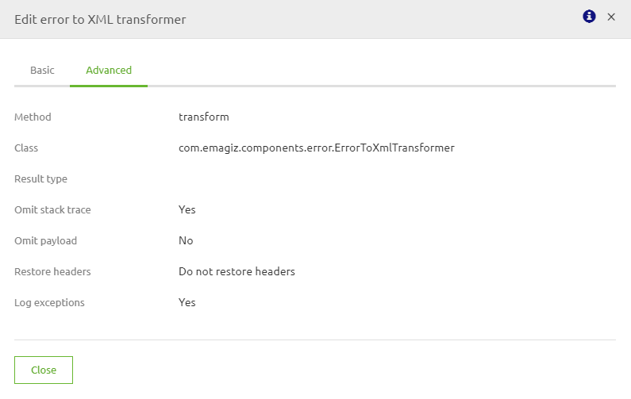
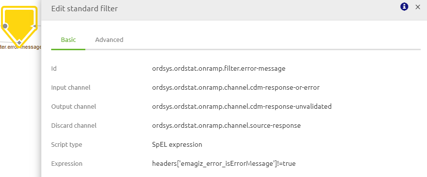
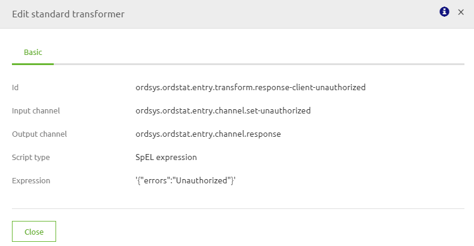

div class="ez-academy">
    

        <main class="micro-learning">
        <ul class="doc-nav">
            <li class="doc-nav__item"><a href="../../docs/migrationpath/index_academy_migrationpath_all" class="doc-nav__link">Home</a></li>
            <li class="doc-nav__item"><a href="#intro" class="doc-nav__link">Intro</a></li>
            <li class="doc-nav__item"><a href="#theory" class="doc-nav__link">Theory</a></li>
            <li class="doc-nav__item"><a href="#practice" class="doc-nav__link">Practice</a></li>
            <li class="doc-nav__item"><a href="#solution" class="doc-nav__link">Solution</a></li>
        </ul>

##### Intro

# Migration Path - Error handling synchronous flows

To correctly manage an eMagiz project, you need robust and stable error handling. This error handling process was the same for both asynchronous and synchronous flows. In this process, all errors thrown by a flow would be routed via the asynchronous error process each eMagiz project has. For synchronous flows, this meant that apart from the actual error, each step in the process that did not receive a message within the set timeframe would subsequently throw a timeout error.
This process had three disadvantages
-   The client needed to wait for the allowed timeout period (default 20000 ms) before knowing whether or not the action succeeded
-   The client only received a generic timeout error instead of information on the error that occurred downstream
-   Any synchronous error could lead to up to five separate error messages making it more confusing and difficult to analyze what was going wrong properly
Based on this consideration, errors are handled in a synchronous flow have changed. See below for the old way, the new way, and how to migrate to the new method.

Should you have any questions, please get in touch with academy@emagiz.com.

- Last update: March 1st, 2022
- Required reading time: 6 minutes

## 1. Prerequisites
- Advanced knowledge of the eMagiz platform
- Synchronous messaging flows in your model

## 2. Key concepts

- The new approach makes sure that the error message is returned to the client
- You have the choice to either write a warning to the log or return an error to the asynchronous error handling as additional functionality

##### Theory

## 3. Migration Path - Error handling synchronous flows

### 3.2 Legacy approach

In the legacy situation, the flow would handle its error message asynchronously. See the picture below for how this is configured in the flow. That way, the other flows in the chain are still waiting for an answer that will never come.

### 3.3 New approach

All (error) messages are returned to the flow preceding the current flow in the new situation. This way, the error message is given back to the client to know what went wrong. This looks as follows in a flow.

### 3.4 How to get to the new approach

Migrating from the old way of handling errors in a synchronous flow to the new way of handling errors in a synchronous flow takes several steps to make it work correctly. Below you will find all these steps. Follow them carefully to achieve the desired result
1. Identify the synchronous flow in your eMagiz project that you want to change
2. Navigate to Create and open the exit
3. Loopback the error to the response channel. See below for the correct configuration

4. Save the flow and go to the offramp
5. Loopback the error to the response channel (see above for the correct configuration)
6. Add a standard filter component and fill it in according to the below specifications

7. Add a new channel and link the components to achieve a result, as shown above under the new section
8. Save the flow
9. Repeat steps 5,6, 7, and 8 for the onramp
10. Open the entry
11. In here, you have the choice to handle the error in two ways
-   Send the error back to the client. This can be achieved by following steps 5,6,7 and 8
-   Send the error to the client after setting the statusCode and the error message. For this, continue with step 12
-   Don’t send the error to the client but the emagiz error flow instead. For this, continue with step 13
12. To specify what the client will see as a response in case of an error, you can change the following two things
-   The statusCode (i.e. 401,403,500,501). This can be done by setting the header, with the help of a standard header enricher, titled http_statusCode, to the desired status code
-   The payload. The payload can be changed to what you want with the help of a standard transformer or an XSLT transformer. An example of this is shown below

13. Add a JMS outbound channel adapter and send the messages to the eMagiz error flow of your project. This way, the message will appear in the Error messages overview of eMagiz, but all timeout errors won’t show up anymore. 
14. Test your changes
-   If possible, test your flowing by using the Unit Test functionality. For more information see [User Guide Unit testing](../microlearning/crashcourse-platform-create-configuring-flow-test.md)
-   Otherwise, test it by deploying the flow and sending a message.
15. Verify your results
-   If the result is the same, you are finished
-   If changes exist, analyze them and make changes to the transformation until you have reached the correct result

Of course, it is possible to use a combination of the suggestion made in steps 11, 12, and 13 to configure the error handling to your specific use case. If you plan to implement a new synchronous flow, please consider the API Gateway functionality. For more information please see [ User Guide API Gateway](../microlearning/crashcourse-api-gateway-index.md)

Congratulations, you have successfully migrated the error handling of your synchronous flows to the new best practice.

##### Practice

## 4. Key takeaways

- The new approach makes sure that the error message is returned to the client
- You have the choice to either write a warning to the log or return an error to the asynchronous error handling as additional functionality

</main>

