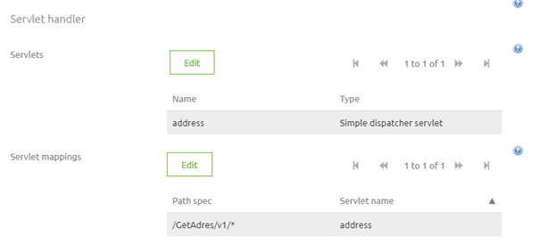
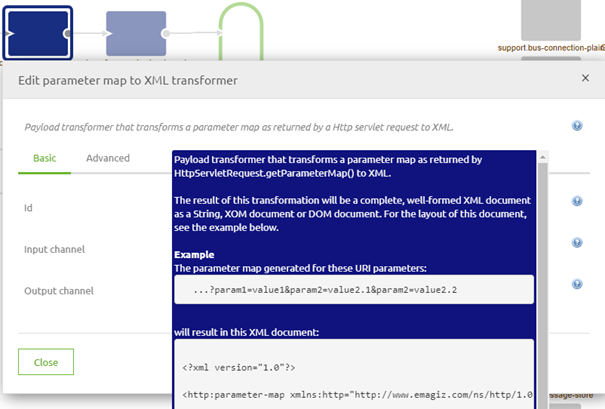
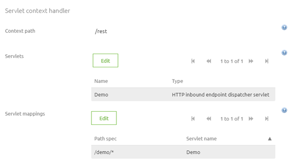
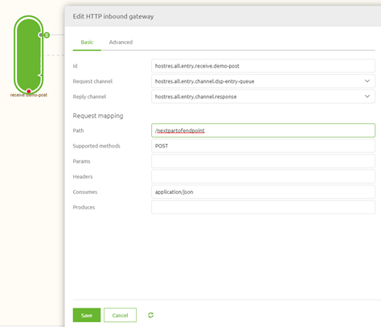
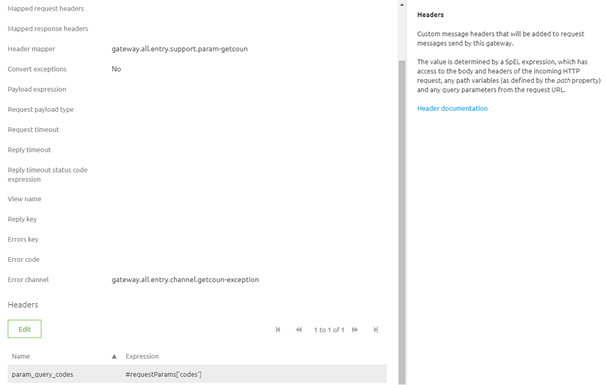

    

        <main class="micro-learning">
        <ul class="doc-nav">
            <li class="doc-nav__item"><a href="../../docs/migrationpath/index_academy_migrationpath_all" class="doc-nav__link">Home</a></li>
            <li class="doc-nav__item"><a href="#intro" class="doc-nav__link">Intro</a></li>
            <li class="doc-nav__item"><a href="#theory" class="doc-nav__link">Theory</a></li>
            <li class="doc-nav__item"><a href="#practice" class="doc-nav__link">Practice</a></li>
            <li class="doc-nav__item"><a href="#solution" class="doc-nav__link">Solution</a></li>
        </ul>

##### Intro

# Migration Path - Hosting a custom REST web service (and using parameters)

Within eMagiz, you have the option to host a SOAP and a REST web service. When dealing with REST web services, the advised choice is the API Gateway in case the call is synchronous in nature. Not in all circumstances; however, the API Gateway completely suits your needs. For example, when the process is asynchronous in the heart, you will need to build your REST web services that eMagiz can host in these situations. The new functionality has become more intuitive to host a custom REST web service via eMagiz.

Should you have any questions, please get in touch with academy@emagiz.com.

- Last update: March 1st, 2022
- Required reading time: 5 minutes

## 1. Prerequisites
- Basic knowledge of the eMagiz platform
- Basic understanding of REST web services

## 2. Key concepts
- These changes make it more intuitively to host a custom REST web service
- The new approach is less dependent on the correct configuration of multiple components

##### Theory

## 3. Migration Path - Hosting a custom REST web service (and using parameters)

Within eMagiz, you have the option to host a SOAP and a REST web service. When dealing with REST web services, the advised choice is the API Gateway in case the call is synchronous in nature. Not in all circumstances; however, the API Gateway completely suits your needs. For example, when the process is asynchronous in the heart, you will need to build your REST web services that eMagiz can host in these situations. The new functionality has become more intuitive to host a custom REST web service via eMagiz.

Below we have detailed the legacy approach, the new approach, and how to migrate from the legacy approach to the new process.

### 3.1 Legacy approach

In the old situation, you would use a Simple Dispatcher servlet to define the correct endpoints that the REST web service would host. See below for how this looks.

Furthermore, you needed to use the HTTP parameter to XML component to map HTTP parameters to XML when dealing with parameters. See below for an illustration of this component.

This component resulted in an XML that needed to be transformed to a correct system message afterward.

### 3.2 New approach

You can more intuitively set up your REST web service in the new situation. For example, you choose the option HTTP Inbound Endpoint Dispatcher Servlet on the jetty server. This gives you the option to define the first part of your endpoint in the Jetty server.

The remainder of your endpoint can now be defined on the Inbound gateway. 

In the advanced tab of the Inbound gateway, you furthermore have the option to add all path and query parameters to separate headers (one header per path or query parameter). This means you can easily use this information further downstream in your mapping when you need it.

### 3.3 How to get to the new approach

Migrating from the old way of hosting a custom REST web service to the new way of hosting a custom REST web service needs several steps to make it work correctly. First, follow them carefully to achieve the desired result.
In this case, a detailed user guide is already available within the portal. So instead of listing the steps once more, we advise you to read that user guide. Please go to [Hosting a REST Webservice](../microlearning/intermediate-rest-webservice-connectivity-index.md)

##### Practice

## 4. Key takeaways

- These changes make it more intuitively to host a custom REST web service
- The new approach is less dependent on the correct configuration of multiple components

</main>

