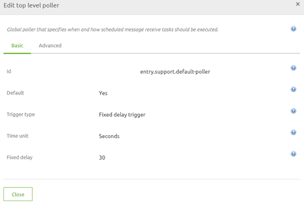
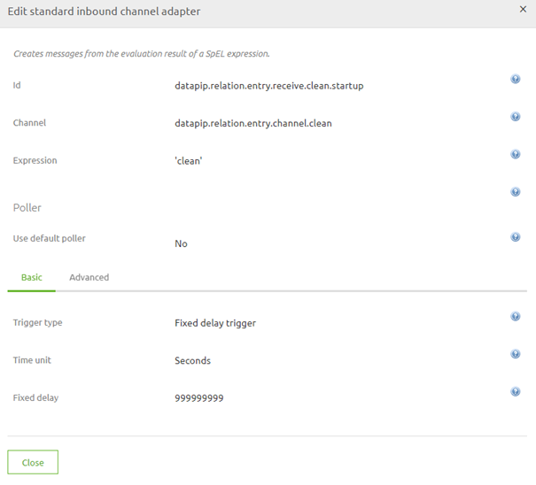

    

        <main class="micro-learning">
        <ul class="doc-nav">
            <li class="doc-nav__item"><a href="../../docs/migrationpath/index_academy_migrationpath_all" class="doc-nav__link">Home</a></li>
            <li class="doc-nav__item"><a href="#intro" class="doc-nav__link">Intro</a></li>
            <li class="doc-nav__item"><a href="#theory" class="doc-nav__link">Theory</a></li>
            <li class="doc-nav__item"><a href="#practice" class="doc-nav__link">Practice</a></li>
            <li class="doc-nav__item"><a href="#solution" class="doc-nav__link">Solution</a></li>
        </ul>

##### Intro

# Migration Path - Job Dashboard Cleanup

Below you will find a document describing the migration path to add the Job Dashboard Cleanup functionality to a data pipeline solution you have previously built.
If you want to implement a new data pipeline, import it from the store, guaranteeing that this functionality will be included.

Should you have any questions, please get in touch with academy@emagiz.com.

- Last update: March 1st, 2022
- Required reading time: 6 minutes

## 1. Prerequisites
- Basic knowledge of the eMagiz platform
- Understanding of Data pipelining concepts
- A existing Data pipeline solution within your eMagiz project.

## 2. Key concepts

- This functionality makes sure that the Job Dashboard will be available and will only show the relevant data of the last 30 days

##### Theory

## 3. Migration Path - Job Dashboard Cleanup

Below you will find a document describing the migration path to add the Job Dashboard Cleanup functionality to a data pipeline solution you have previously built.
If you want to implement a new data pipeline, import it from the store, guaranteeing that this functionality will be included.

### 3.1 Remove unnecessary components

First, we will delete components that have become obsolete as of late. The parts you can remove from the flow are:

- support.bus-connection-plain
- support.bus-connection-caching

Furthermore, you could remove the following debug components as every interesting step is already monitored and can therefore be tracked without the help of the debugger:

- global channel interceptor
- activate.debug-bridge
- send.debug
- entry.channel.debug-queue
- debugBridgeChannel

### 3.2 Add new components to cleanup the Job Dashboard

We have made it possible to clean up the Job Dashboard for you with the new functionality. This ensures that you can keep accessing the job info of the last month of job activity.

To make sure that your existing data pipeline will function in the same way, you should execute the following steps:

- Add a support object called top level poller and configure it as follows
    

- Add a channel called clean
- Add a standard inbound channel adapter called clean.cron and configure it as follows (As you can see it cleans the job dashboard every day at five in the morning)
    

- Add a standard inbound channel adapter called startup.cron and configure it as follows (It cleans the job dashboard on startup)
    

- Add a JDBC outbound channel adapter to your flow
    - Use the clean channel as input
    - Link it to the h2 database that is in your flow
    - Enter the query that you can find below
    

    
### 3.2 Query you need for cleanup

The following query is needed to cleanup all relevant parts of the job dashboard to ensure that only the last month's jobs are still visible.

DELETE FROM BATCH_JOB_EXECUTION_CONTEXT WHERE
JOB_EXECUTION_ID IN (SELECT JOB_EXECUTION_ID FROM BATCH_JOB_EXECUTION WHERE DATEADD(MONTH, 1, CREATE_TIME) < CURDATE());
DELETE FROM BATCH_JOB_EXECUTION_PARAMS WHERE
JOB_EXECUTION_ID IN (SELECT JOB_EXECUTION_ID FROM BATCH_JOB_EXECUTION WHERE DATEADD(MONTH, 1, CREATE_TIME) < CURDATE());
DELETE FROM BATCH_STEP_EXECUTION_CONTEXT WHERE
STEP_EXECUTION_ID IN (SELECT STEP_EXECUTION_ID FROM BATCH_STEP_EXECUTION WHERE
JOB_EXECUTION_ID IN (SELECT JOB_EXECUTION_ID FROM BATCH_JOB_EXECUTION WHERE DATEADD(MONTH, 1, CREATE_TIME) < CURDATE()));
DELETE FROM BATCH_STEP_EXECUTION WHERE
JOB_EXECUTION_ID IN (SELECT JOB_EXECUTION_ID FROM BATCH_JOB_EXECUTION WHERE DATEADD(MONTH, 1, CREATE_TIME) < CURDATE());
DELETE FROM BATCH_JOB_EXECUTION WHERE DATEADD(MONTH, 1, CREATE_TIME) < CURDATE();
DELETE FROM BATCH_JOB_INSTANCE WHERE
JOB_INSTANCE_ID NOT IN (SELECT JOB_INSTANCE_ID FROM BATCH_JOB_EXECUTION);

### 3.3 Result

The result should look something like this:

##### Practice

## 4. Key takeaways

- This functionality makes sure that the Job Dashboard will be available and will only show the relevant data of the last 30 days

</main>

