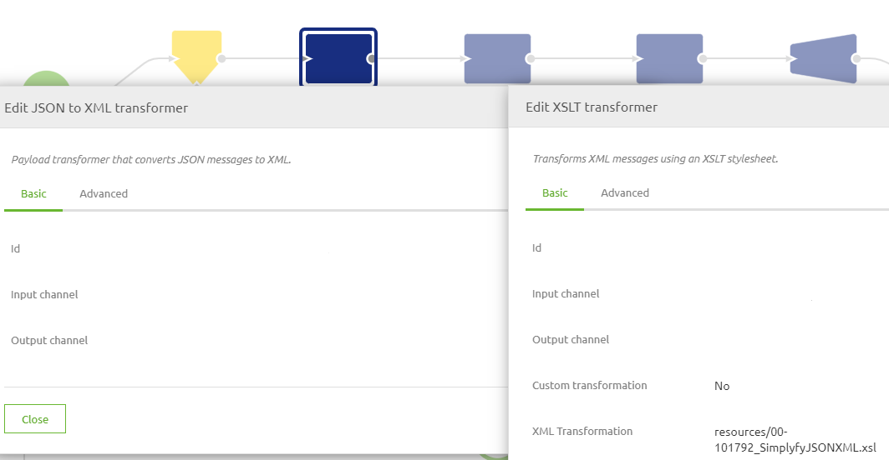
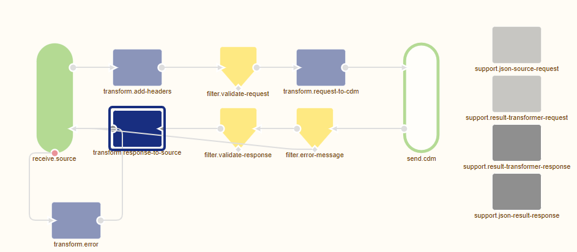
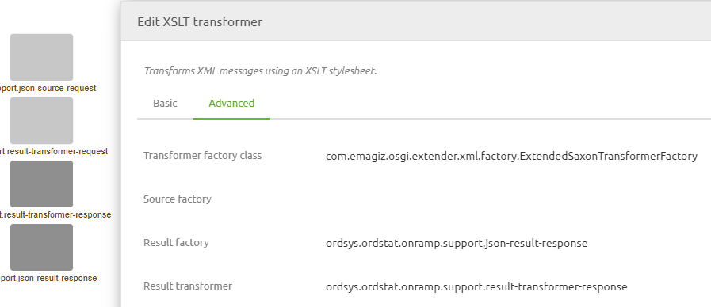
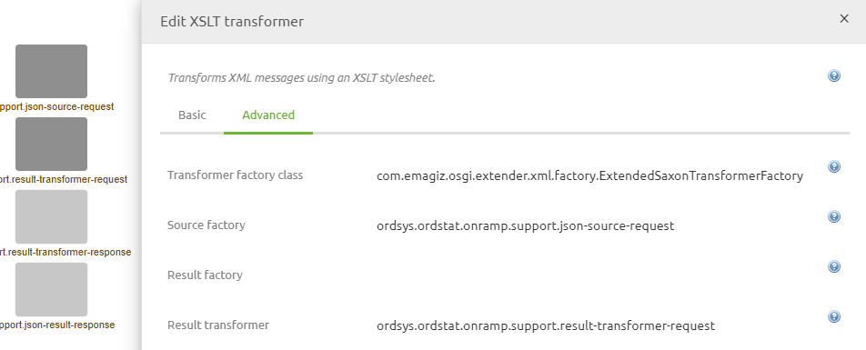

    

        <main class="micro-learning">
        <ul class="doc-nav">
            <li class="doc-nav__item"><a href="../../docs/migrationpath/index_academy_migrationpath_all" class="doc-nav__link">Home</a></li>
            <li class="doc-nav__item"><a href="#intro" class="doc-nav__link">Intro</a></li>
            <li class="doc-nav__item"><a href="#theory" class="doc-nav__link">Theory</a></li>
            <li class="doc-nav__item"><a href="#practice" class="doc-nav__link">Practice</a></li>
            <li class="doc-nav__item"><a href="#solution" class="doc-nav__link">Solution</a></li>
        </ul>

##### Intro

# Migration Path - JSON Related Transformations

Within eMagiz, you have the option to transform messages from JSON to XML, XML to JSON, and from JSON to JSON. In all these scenarios, you had to resort to using at least a custom XSLT, sometimes even in combination with standard components provided by eMagiz. With the new functionality, it has become possible to define what the input and output of a message transformation are and have the option to interpret the input against which can be validated.

Should you have any questions, please get in touch with academy@emagiz.com.

- Last update: March 1st, 2022
- Required reading time: 6 minutes

## 1. Prerequisites
- Basic knowledge of the eMagiz platform
- Basic knowledge of JSON to XML transformations and vice versa

## 2. Key concepts
- The new approach allows you to use the transformation tooling in Design to create your mapping from JSON to XML

##### Theory

## 3. Migration Path - JSON Related Transformations

### 3.1 Legacy approach

In the Legacy situation, you need to have at least one custom XSLT to transform between JSON and XML (or JSON). A classic example of converting from JSON to XML looks as follows.

Here you would use the standard component to transform from JSON to XML followed by a standardized XSLT available through the store. A similar setup was needed when converting XML to JSON.

### 3.2 New approach

In the new situation, you can start your work in Design as you do when transforming XML to XML. The same can now be done with JSON to XML transformations. Note that the definition should have an additional root element (by default, eMagiz calls the element root) to make the validation and transformation work as it should be. After setting your system message and message mapping as you are just to, you can navigate to Create and build the flow. Then, within the flow, some minor changes are needed. See below for a representation of how this looks in Create.

### 3.3 How to get to the new approach

Migrating from the old way of transforming messages with regards to JSON to the new way of transforming messages with regards to JSON takes several steps to make it work correctly. Below you will find all these steps. Follow them carefully to achieve the desired result.

1. Navigate to Design -> System message for the flow you are currently want to change to determine whether you already have a system message with a specific added root element
a)  If yes, continue with step 9
b)  If no, continue with step 2
2. See if you have an XSD against which you could validate the JSON messages.
a)  If yes, continue with step 2
b)  If not, continue with step 6
3. Open the XSD via Notepad++ (or any other tool that can show XSD messages) and add an element to the root of the message. The default name would be root but can be anything you want.
4. Navigate to Capture
5. Upload the XSD to the message flow you are currently working on
6. Navigate to Design
7. Import the XSD via the option From Capture in your system message if you have one. If not, create the system message by hand (Don’t forget to add a specific root element)
8. Navigate to Design -> Message mapping to create the message mapping between system and CDM message
9. Navigate to Create
10. Open the flow for which you have changed the system message and the message mapping
11. Press Start Editing
12. Determine whether any validation component has a JSON message as input in your flow. For example:
o   In an asynchronous onramp, this would be the validation you encounter first in your flow. 
o   In an asynchronous offramp, no validations need to be changed because you validate the CDM, which is still based on XML. 
o   This logic applies the same for other asynchronous and synchronous flows. 
13. If the answer is yes for the flow you are currently editing, you should add a JSON source factory support object and couple this to the validation. See below for how this looks

14. Determine whether any transformation component in your flow has a JSON message. For example:
a)  In an asynchronous onramp, this would be the standard transformation based on your message mapping made in Design
b)  In an asynchronous offramp, no transformation will have JSON as input because here you transform message from CDM to system message and the CDM and that is still based on XML. 
c)  This logic applies the same for other asynchronous and synchronous flows. 
15. If the answer is yes for the flow you are currently editing, you have a choice to make
a)  If the output is JSON, you have to add two support objects. One support object is called JSON result transformer, and the other is JSON result factory. See step 16 for more details
b)  If the output is XML, you must add one support object. This support object is called the result to string transformer. See step 17 for more details
16. Couple the just created support objects to your transformation as shown below

Congratulations, you have successfully migrated your current flow to transform JSON message
17. Couple the just created support object to your transformation as shown below

Congratulations, you have successfully migrated your current flow to transform JSON message.

##### Practice

## 4. Key takeaways

- The new approach allows you to use the transformation tooling in Design to create your mapping from JSON to XML

</main>

