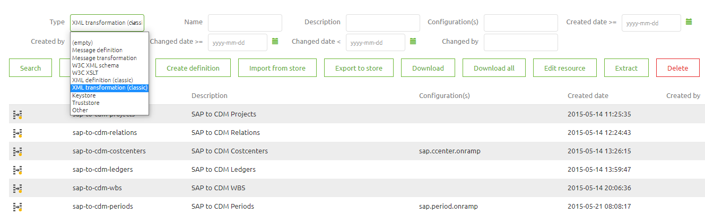
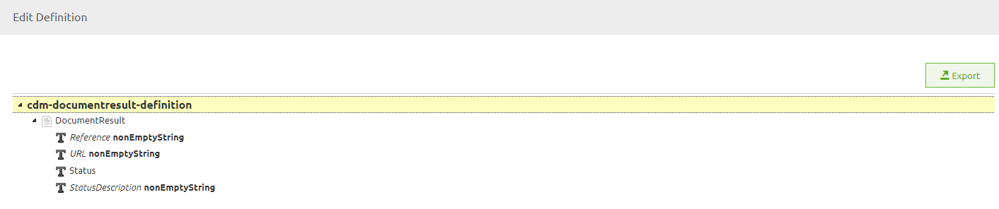
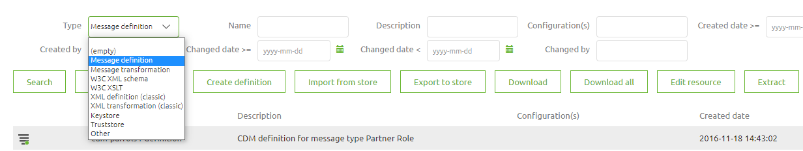
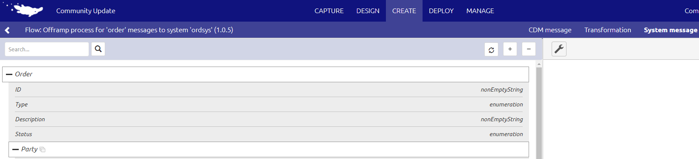

    

        <main class="micro-learning">
        <ul class="doc-nav">
            <li class="doc-nav__item"><a href="../../docs/migrationpath/index_academy_migrationpath_all" class="doc-nav__link">Home</a></li>
            <li class="doc-nav__item"><a href="#intro" class="doc-nav__link">Intro</a></li>
            <li class="doc-nav__item"><a href="#theory" class="doc-nav__link">Theory</a></li>
            <li class="doc-nav__item"><a href="#practice" class="doc-nav__link">Practice</a></li>
            <li class="doc-nav__item"><a href="#solution" class="doc-nav__link">Solution</a></li>
        </ul>

##### Intro

# Migration Path - Old Transformation Tooling

A key feature of eMagiz always has been to visually see what you need to transform from A to B. At a certain point, eMagiz provided a new way of Designing the transformation. This meant two things. The Design phase in eMagiz has become the place to set up your transformations instead of doing everything in Create. This way, your integration process became more intuitive and less complex.

Should you have any questions, please get in touch with academy@emagiz.com.

- Last update: March 1st, 2022
- Required reading time: 7 minutes

## 1. Prerequisites
- Basic knowledge of the eMagiz platform

## 2. Key concepts
- The new transformation tooling allows you to define your solutions in Design and finish them in Create
- The new tooling allows you to define one eMagiz data model and use parts of the model for message definitions
- The old tooling will be deprecated as of June 1st, 2022

##### Theory

## 3. Migration Path - Old Transformation Tooling

A key feature of eMagiz always has been to visually see what you need to transform from A to B. At a certain point, eMagiz provided a new way of Designing the transformation. This meant two things. The Design phase in eMagiz has become the place to set up your transformations instead of doing everything in Create. This way, your integration process became more intuitive and less complex.

### 3.1 Legacy approach
You can identify Legacy resources (transformation or validation) by navigating to Create -> Resources. In here you can search for XML definition (classic) or XML transformation (classic). All results are resources created with the old transformation tooling and need to be migrated if the resource in question is still being used in a flow. You can see whether they are still used by looking at the configuration column.

Opening a definition in the old tooling will look like this.

### 3.2 New approach
You can identify New resources (transformation or validation) by navigating to Create -> Resources. Here you can search for Message Definition or Message Transformation. All results are resources created with the new transformation tooling. These resources don’t need to be migrated. You can see whether they are still used by looking at the configuration column. If not used, you can remove these resources as part of your lifecycle management process after verifying if they are indeed not used anymore.

Opening a definition in the new tooling will look something like this.

### 3.3 How to get to the new approach
Migrating from the old tooling to the new tooling takes several steps to make it work correctly. Below you will find all these steps. Follow them carefully to achieve the desired result
1. Download the XSD, from Create -> Resources, of the system message for the flow you want to migrate
2. Download the XSD, from Create -> Resources, of the CDM message for the flow you want to migrate
3. Download the XSLT, from Create -> Resources, of the transformation between the system message and CDM
4. Navigate to Design
5. Open the CDM
6. Open the XSD of the CDM message to see how the CDM message looks
7. Verify if the entities and attributes in your CDM message are already available in the CDM that you have currently open
-   If yes, continue with step 9
-   If no, continue with step 8
8. Add the missing entities and attributes to your CDM that is needed in your CDM message
9. Open the message type of the flow for which you want to migrate
10. Construct the CDM message based on the XSD you downloaded in step 2
At this point, you have successfully migrated your CDM XSD to the new transformation tooling
11. Navigate to Capture
12. Open the information page for the flow for which you want to migrate
13. Add the XSD that you downloaded in step 1 as XSD to Message Content
14. Navigate to Design
15. Open the system message page for the flow for which you want to migrate
16. Press the import button and select From Capture
17. Select the XSD you have added to Capture in Step 13
Congratulations, at this point, you have successfully migrated your system message to the new transformation tooling
18. Navigate to the message mapping page.
19. Draw the lines between system message and CDM (or vice versa) based on the XSLT you downloaded in step 3. Based on the color of the background, you can see which part of the screen is CDM (green) and system message (blue)
Now you have successfully transformed the XSLT into the Message Mapping in Design
20. Navigate to Create
21. Open the flow for which you want to migrate
22. Open the tabs System message, CDM message, and Transformation one by one to verify if the results of the previous steps in Design are visible in Create.
23. If the results **not** visible, continue with step 24. If the results **are** visible, continue with step 36
24. Press Start Editing
25. Navigate to Resources
26. Press Add bus resources to flow
26. Search for other standard resources and add them to the flow (take any resource that is related to another flow to ensure that the link between the flow and any resource is severed)
-   In an onramp, you need the system message validation and the transformation from system to CDM
-   In an offramp, you need the CDM message validation and the transformation from CDM to system
27. Press Stop Editing
28. If you are working on an offramp, open the exit accompanying the offramp and continue with step 29. If not, continue with step 33
29. Press Start Editing
30. Navigate to Resources
31. Press Add bus resources to flow
32. Search for other standard resources and add them to the flow (take any resource that is related to another flow to ensure that the link between the flow and any resource is severed)
-   In an exit, you need a system message validation
33. Navigate to Create -> Resources and search for the resources that eMagiz should have created for you (based on the naming convention)
34. Remove those resources
35. Navigate back to the flow for which you want the resources to be generated correctly
36. Press Start Editing
37. Navigate to Resources
38. Press Add bus resources to flow
39. Search for the correct resources and add them to the flow
-   In an onramp, you need the system message validation and the transformation from system to CDM
-   In an offramp, you need the CDM message validation and the transformation from CDM to system
40. Link the resources to their respective components in the flow
After this, you have successfully linked the new transformation tooling resources to your flow in Create
41. Verify based on the XSLT downloaded in step 3 if changes have to be made to the transformation made in step 19. This can be done by comparing the old and new XSLT. The new XSLT can be downloaded via the Resources tab of the flow
-   If no changes are necessary, continue with step 43
-   If changes are necessary, continue with step 42
42. Recreate the old mapping logic via the Transformation page in the flow. This can be done in various ways
-   Filter
-   Transformation
-   Static Input
-   Aggregation
-   Grouping
Now you have migrated from the old to the new tooling. The last step will verify that everything works the same as before. This can be done in two ways
43. Test your changes
-   If possible, test your flowing by using the Unit Test functionality. For more information see [User Guide Unit testing](../microlearning/crashcourse-platform-create-configuring-flow-test.md)
-   Otherwise, test it by deploying the flow and sending a message.
44. Verify your results
-   If the result is the same, you are finished
-   If changes exist, analyze them and make changes to the transformation until you have reached the correct result
Congratulation, you have successfully migrated your flow from the old transformation tooling to the new transformation tooling.

##### Practice

## 4. Key takeaways

- The new transformation tooling allows you to define your solutions in Design and finish them in Create
- The new tooling allows you to define one eMagiz data model and use parts of the model for message definitions
- The old tooling will be deprecated as of June 1st, 2022

</main>

