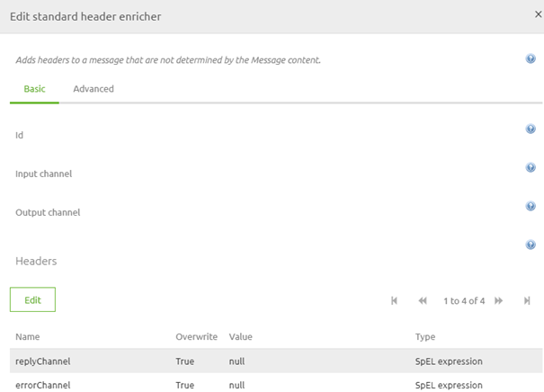
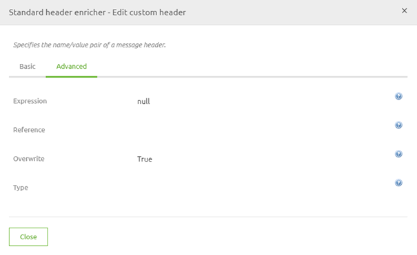
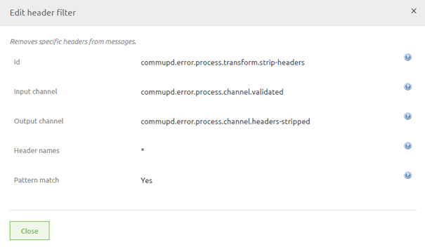

    

        <main class="micro-learning">
        <ul class="doc-nav">
            <li class="doc-nav__item"><a href="../../docs/migrationpath/index_academy_migrationpath_all" class="doc-nav__link">Home</a></li>
            <li class="doc-nav__item"><a href="#intro" class="doc-nav__link">Intro</a></li>
            <li class="doc-nav__item"><a href="#theory" class="doc-nav__link">Theory</a></li>
            <li class="doc-nav__item"><a href="#practice" class="doc-nav__link">Practice</a></li>
            <li class="doc-nav__item"><a href="#solution" class="doc-nav__link">Solution</a></li>
        </ul>

##### Intro

# Migration Path - Removing headers from your message

Within eMagiz, you can place headers on your message, and you can subsequently also remove these headers again. For example, when some form of authentication is placed in headers, you do not want to send this information to an external party connecting to another system. Removing headers has been a tedious process, but with some new functionality, it is easier and more evident to remove them.

Should you have any questions, please get in touch with academy@emagiz.com.

- Last update: March 1st, 2022
- Required reading time: 4 minutes

## 1. Prerequisites
- Basic knowledge of the eMagiz platform

## 2. Key concepts
- There is a specific component called "Header filter" that will remove the headers for you
- In this component, you can define all headers you want to filter out of your message

##### Theory

## 3. Migration Path - Removing headers from your message

Within eMagiz, you can place headers on your message, and you can subsequently also remove these headers again. For example, when some form of authentication is placed in headers, you do not want to send this information to an external party connecting to another system. Removing headers has been a tedious process, but with some new functionality, it is easier and more evident to remove them.

### 3.1 Legacy approach

In the old situation, you need to add a standard header enricher to your flow and set the header to null via a SPeL expression.

### 3.2 New approach

In the new situation, you can more intuitively set up the removal of these headers. This can be done by using a unique and specific component that has the sole purpose of removing headers from your message. The part is called the header filter, and in it, you can define the names of all headers you want to remove. For example, a wildcard search using an asterisk (*) is also possible. This way, you remove all custom set headers from your message. See below for an illustration.

### 3.3 How to get to the new approach

Migrating from the old way of removing headers from messages to the new way of eliminating them takes several steps to make it work correctly. Below you will find all these steps. Follow them carefully to achieve the desired result.

1. Identify a flow where you remove a header in the old way or don't remove the header at all where it would be wise to do so (in case of authentication, for example, or privacy-sensitive information)
2. Add the header filter component to the flow
3. Add the correct header names (or a wildcard) to the header names field
4. Press Save
5. Remove the old functionality where you set the value to null for a specific header.

Congratulations, you have successfully migrated to an excellent and easy way to remove headers from your message.

##### Practice

## 4. Key takeaways

- There is a specific component called "Header filter" that will remove the headers for you
- In this component, you can define all headers you want to filter out of your message

</main>

