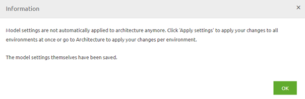

    

        <main class="micro-learning">
        <ul class="doc-nav">
            <li class="doc-nav__item"><a href="../../docs/migrationpath/index_academy_migrationpath_all" class="doc-nav__link">Home</a></li>
            <li class="doc-nav__item"><a href="#intro" class="doc-nav__link">Intro</a></li>
            <li class="doc-nav__item"><a href="#theory" class="doc-nav__link">Theory</a></li>
            <li class="doc-nav__item"><a href="#practice" class="doc-nav__link">Practice</a></li>
            <li class="doc-nav__item"><a href="#solution" class="doc-nav__link">Solution</a></li>
        </ul>

##### Intro

# Migration Path - Root Cloud to eMagiz Cloud 

eMagiz offers the possibility to migrate your infrastructure from one cloud provider to another. This can be done in various easy steps. This document will describe the steps one needs to take to successfully migrate from Root to the eMagiz Cloud.

Should you have any questions, please get in touch with academy@emagiz.com.

- Last update: March 1st, 2022
- Required reading time: 6 minutes

## 1. Prerequisites
- Advanced knowledge of the eMagiz platform
- Assistance is needed from the eMagiz product development team, so plan and contact your partner manager early on to make this work.

## 2. Key concepts
This chapter outlines the best practices for migrating from Root to the eMagiz Cloud.
- Plan ahead as some steps require the assistance of an eMagiz development team colleague
- Consult your partner manager beforehand to see if there is a possible cloud slot that you can use for your solution
- Always update the JMS as this is mandatory
- Store the settings you used in Root as you need to remove the complete Root set up before you can switch over to the eMagiz Cloud
- Test your actions in Test and Acceptance before moving to Production
- Ensure to have the property for the data directory for JMS created. <bus_technical_name>.jmsserver.datadir=/efs/data/Artemis/jms01

##### Theory

## 3. Migration Path - Root Cloud to eMagiz Cloud

eMagiz offers the possibility to migrate your infrastructure from one cloud provider to another. This can be done in various easy steps. This document will describe the steps one needs to take to successfully migrate from Root to the eMagiz Cloud.

Below we have written down the steps to migrate from the Root cloud to the eMagiz Cloud. Follow these steps carefully to acquire the desired result.

### 3.1 Edit the settings in Design (once)
To do so, navigate, for your bus, to the Design page and click on Settings in the right top hand corner. When you have opened the Settings page, press the Edit settings button and select AWS as the IaaS you want to use.
When pressing Save, you will see the below pop-up:

As the pop-up clearly states, you will have to apply these changes to each environment independently via Design -> Architecture. The best practice is to test these changes in Test and Acceptance before executing them on Production.

### 3.2 Press Apply bus settings under Design -> Architecture (per environment)
Navigate to Design -> Architecture and navigate to the environment you need to apply the settings. Start at Test and move only ahead to Acceptance or Production when everything is tested correctly. Press Apply bus settings. Nothing should change because you have moved from one cloud provider to another.

### 3.3 Transfer settings from Design (once)
In this step, you transfer the settings you have changed in step 2 to Create. This can be done via Create -> Settings -> Transfer settings from Design.

This step will mean a new version for all flows on your bus. Be aware, on the JMS level, that some changes are applied. So a new version of the JMS is mandatory. Although nothing else has changed, at least not for this scenario, once again, the best practice is to first test everything (at least) on Acceptance before moving to Production.

### 3.4 Check and store custom settings made to Root cloud (per environment)

To check these settings, you need to navigate to Deploy -> Cloud and check if one of the following cases applies:

-   Firewall forwarding rules
o   If these apply, register the incoming port and which connector they are using. You will need to configure these again when switching over to AWS
-   Speciality VM’s
o   Consult your partner manager what the exact use is of this specialty VM and if this will work without problems in AWS without the intervention of the eMagiz team

### 3.5 Remove Root Cloud machines (per environment)

Stop all running connector, container, and firewall machines and delete them one by one. The advised order:
-   Connector
-   Container
-   Firewall

### 3.6 Remove the association between Bus environment and Root cloud slot (eMagiz admin needed!) (per environment)
Make an appointment with your partner manager to remove the link between the bus environment and a root cloud slot. You can continue with the next step when they have released this link.

### 3.7 Apply to environment  (per environment)
Navigate to Deploy -> Architecture and press apply to environment. If you have not executed the previous steps correctly, you will get a warning that you are not allowed to do this. If you get this warning, go back to the beginning and check your work. When everything goes okay, you will see the pop-up you are familiar with saying that eMagiz is updating/creating the AWS environment. You can monitor this process by clicking on Details away from any machine and looking at the last known state.

### 3.8 Set Scheduled Sleep (eMagiz admin needed) (per environment)
If you are migrating a Test and Acceptance environment, set Scheduled Sleep to yes unless specific contractual agreements have been agreed upon between all parties involved (i.e., customer, partner, and eMagiz)

### 3.9 Check your work
If all previous steps have been executed correctly, you should now navigate to Manage and see the logging of runtimes starting up again. Once again, you will be able to reach these runtimes via the Runtime Dashboard located in the Deploy phase of eMagiz.

##### Practice

## 4. Key takeaways

- Plan ahead as some steps require the assistance of an eMagiz development team colleague
- Consult your partner manager beforehand to see if there is a possible cloud slot that you can use for your solution
- Always update the JMS as this is mandatory
- Store the settings you used in Root as you need to remove the complete Root set up before you can switch over to the eMagiz Cloud
- Test your actions in Test and Acceptance before moving to Production
- Ensure to have the property for the data directory for JMS created. <bus_technical_name>.jmsserver.datadir=/efs/data/Artemis/jms01

</main>

