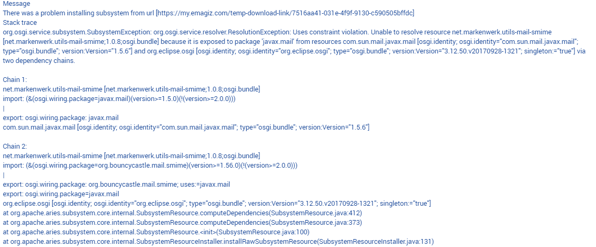

    

        <main class="micro-learning">
        <ul class="doc-nav">
            <li class="doc-nav__item"><a href="../../docs/rca-knowledgebase/index_academy_rca-knowledgebase_all" class="doc-nav__link">Home</a></li>
            <li class="doc-nav__item"><a href="#situation" class="doc-nav__link">Situation</a></li>
            <li class="doc-nav__item"><a href="#problem" class="doc-nav__link">Problem</a></li>
            <li class="doc-nav__item"><a href="#analysis" class="doc-nav__link">Analysis</a></li>
            <li class="doc-nav__item"><a href="#result" class="doc-nav__link">Result</a></li>
        </ul>

# RCA - Template match error for missing code mappings

In this document, we will use the information from the actual root cause analysis to make a generic view that can be used if you run into the same or a similar problem in the future. Finally, the document will describe the situation, the problem, the analysis, and the result.

Should you have any questions, please get in touch with academy@emagiz.com.

- Last update: March 15th, 2022
- Required reading time: 3 minutes

##### Situation

## 3. RCA - Flows not installed on runtime

### 3.1 Situation
For a new release that was deployed, one of the systems didn't install any flow other than the infra flow. 

##### Problem

### 3.2 Problem
The system was not operational and not functional causing a downtime of the business process to send invoices.

##### Analysis

### 3.3 Analysis

#### 3.3.1 Errors in eMagiz
To analyze the problem, we first looked at the errors within the environment to get a sense of the issue at hand. See below for the errors observed. The error indicates a specific library loading  problem. The duplicate dependency chain means that there two libraries loaded on the same path, making it ambiguous for the runtime to choose which library to load

#### 3.3.2 Runtime dashboard view

We have also looked at the runtime dashboard, where you could see that only the infra flow was installed and started. But no other flows where installed. Furthermore, the latest or newest build number was loaded for that flow. On Acceptance the same system existed and all flows where started properly. There is no screenshot attached here due to confidentiality.

#### 3.3.3 Reset action

The first regular action would be to reset the runtime to ensure the data folder that contains cached data is cleared. This action didn't resolve the issue, allthough it was expected to fix the issue. 

#### 3.3.4 Alternative reset action

Due to the fact that the flows are working properly in the Acceptance environment, combined with the duplicate dependency chain it was concluded that the libraries that are downloaded from the eMagiz repository are in conflict. The build number is a reference to a set of libraries that need to loaded into the runtime to make these flows operational. Apparently the runtime was still containing older libraries from the previous build number, causing the conflict.

The step to perform an alternative reset where the following:
    1. In Design architecture, move the runtime from the Cloud Connector machine to a Local Connector machine
    2. In Desploy Architecture, press the Apply to environment button and wait for a few minutes to allow the Cloud slot to effectuate & specifically clean the entire runtime
    3. In Design architecture, move the runtime from the Local Connector machine to the Cloud Connector machine
    4. In Desploy Architecture, press the Apply to environment button and wait for a few minutes to allow the Cloud slot to effectuate
    5. Verify the runtime dashboard to see of the flows where installed and started.

##### Result

### 3.4 Result
The runtime was cleaned up 100% from the Cloud slot, allow the local repository to be cleaned-up. This is a sibling folder to the data folder, and contains the libraries. The reset runtime action in the Deploy Architecture cleans up the data folder (jincludint the H2 folder) but doesn't cleanup the libraries. In normal cases, new build numbers do not have such behavior but in specific cases this can be a alternative to the reset runtime action.

</main>

