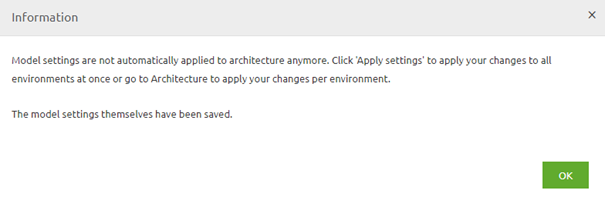
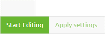
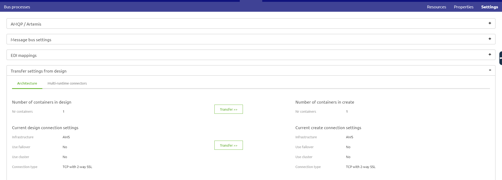

    

        <main class="micro-learning">
        <ul class="doc-nav">
            <li class="doc-nav__item"><a href="../../docs/rca-knowledgebase/index_academy_rca-knowledgebase_all" class="doc-nav__link">Home</a></li>
            <li class="doc-nav__item"><a href="#intro" class="doc-nav__link">Intro</a></li>
            <li class="doc-nav__item"><a href="#theory" class="doc-nav__link">Theory</a></li>
            <li class="doc-nav__item"><a href="#practice" class="doc-nav__link">Practice</a></li>
            <li class="doc-nav__item"><a href="#solution" class="doc-nav__link">Solution</a></li>
        </ul>

##### Intro

# RCA - Data loss during production change

In this document, we will use the information from the actual root cause analysis to make a generic view that can be used if you run into the same or a similar problem in the future. The document will describe the situation, the problem, the analysis, and the result of the analysis.

Should you have any questions, please get in touch with academy@emagiz.com.

- Last update: March 8th, 2022
- Required reading time: 6 minutes

## 1. Prerequisites
- Advanced knowledge of the eMagiz platform

## 2. Key concepts
- When executing a change on production always consider the impact
- Temporary data is not kept when resetting a runtime in the cloud

##### Theory

## 3. RCA - Data loss during production change

In this document, we will use the information from the actual root cause analysis to make a generic view that can be used if you run into the same or a similar problem in the future. The document will describe the situation, the problem, the analysis, and the result of the analysis.

Below we have written down various phases to help you determine whether this document can help you identify and resolve your problems.

### 3.1 Situation
To do so, navigate, for your bus, to the Design page and click on Settings in the right top hand corner. When you have opened the Settings page, press the Edit settings button and select AWS as the IaaS you want to use.
When pressing Save, you will see the below pop-up:

As the pop-up clearly states, you will have to apply these changes to each environment independently via Design -> Architecture. The best practice is to test these changes in Test and Acceptance before executing them on Production.

### 3.2 Problem
Navigate to Design -> Architecture and navigate to the environment you need to apply the settings. Start at Test and move only ahead to Acceptance or Production when everything is tested correctly. Press Apply bus settings. Nothing should change because you have moved from one cloud provider to another.

### 3.3 Analysis
In this step, you transfer the settings you have changed in step 2 to Create. This can be done via Create -> Settings -> Transfer settings from Design.

This step will mean a new version for all flows on your bus. Be aware, on the JMS level, that some changes are applied. So a new version of the JMS is mandatory. Although nothing else has changed, at least not for this scenario, once again, the best practice is to first test everything (at least) on Acceptance before moving to Production.

### 3.4 Result

To check these settings, you need to navigate to Deploy -> Cloud and check if one of the following cases applies:

-   Firewall forwarding rules
o   If these apply, register the incoming port and which connector they are using. You will need to configure these again when switching over to AWS
-   Speciality VM’s
o   Consult your partner manager what the exact use is of this specialty VM and if this will work without problems in AWS without the intervention of the eMagiz team

##### Practice

## 4. Key takeaways

- When executing a change on production always consider the impact
- Temporary data is not kept when resetting a runtime in the cloud

</main>

