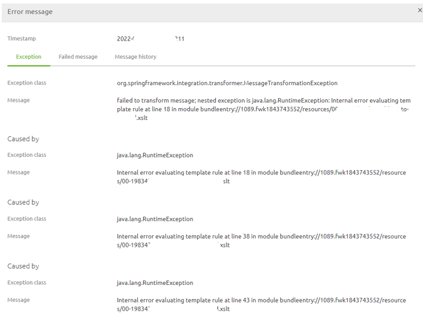
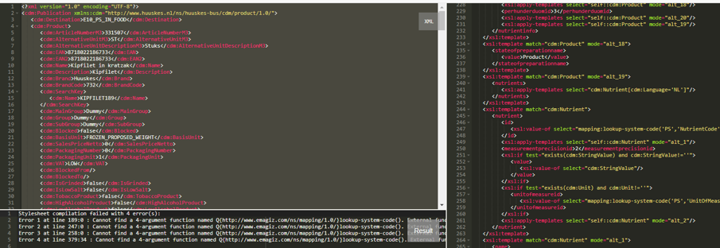
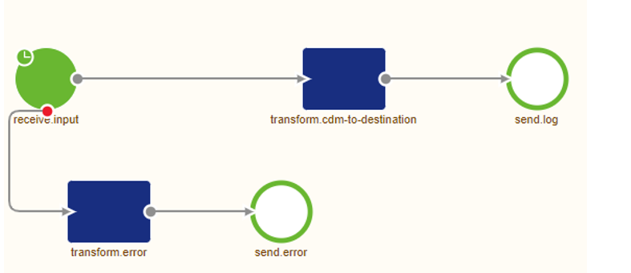

    

        <main class="micro-learning">
        <ul class="doc-nav">
            <li class="doc-nav__item"><a href="../../docs/rca-knowledgebase/index_academy_rca-knowledgebase_all" class="doc-nav__link">Home</a></li>
            <li class="doc-nav__item"><a href="#situation" class="doc-nav__link">Situation</a></li>
            <li class="doc-nav__item"><a href="#problem" class="doc-nav__link">Problem</a></li>
            <li class="doc-nav__item"><a href="#analysis" class="doc-nav__link">Analysis</a></li>
            <li class="doc-nav__item"><a href="#result" class="doc-nav__link">Result</a></li>
        </ul>

# RCA - Template match error for missing code mappings

In this document, we will use the information from the actual root cause analysis to make a generic view that can be used if you run into the same or a similar problem in the future. Finally, the document will describe the situation, the problem, the analysis, and the result.

Should you have any questions, please get in touch with academy@emagiz.com.

- Last update: March 8th, 2022
- Required reading time: 4 minutes

##### Situation

## 3. RCA - Unable to find valid certification path

### 3.1 Situation
Since several days publication messages towards a specific system were rejected in the transformation within eMagiz due to an template evaluation error. In the ticket we could read that although the transformation was not working in eMagiz it was working in other tooling (i.e. XSLT fiddle). The error repeated itself many times and the flow was stopped to prevent data measurement issues in eMagiz

##### Problem

### 3.2 Problem
The result of the issue was the business process couldn't use updated information from that specific data stream. Data presented in the business process was outdated for some parts

##### Analysis

### 3.3 Analysis

#### 3.3.1 Errors in eMagiz
To analyze the problem, we first looked at the errors within the environment to get a sense of the issue at hand. See below for the errors observed. The error indicates a transformation problem.

#### 3.3.2 Transformation verification

Secondly, we used the transformation resource and the failed message payload to verify the correct working of the transformation. From that we could see the errors in the transformation around the code mappings. Removing the code mapping resulted in a correct transformation. This feedback led us to believe that the problem lied somewhere with these code mapping lines.

#### 3.3.3 Code mapping verification

There are 4 code mapping transformations used in this flow. Each code mapping was inspected by comparing the input values of the failed messages to the actual code mappings. Objective was to find out a missing code mapping. This resulted in locating a missing code mapping.

#### 3.3.3 Code mapping verification
To reproduce the issue we built a separate flow in a separate model that received the input and transformed it. Once it reached the end a Warning in the log with the text “Success” would be written. At first we tested our hypothesis by not defining the code mapping found in the previous step. This led, as expected, to the same error as we saw in the client environment.
 
 

Subsequently we add the missing value to the code mapping list of this model and ran the test again. As a result we got a line in the log stating Success for each time the test ran.

##### Result

### 3.4 Result
The reported incident in which the transformation in eMagiz failed was ultimately caused by an incorrect configuration of the code mappings functionality within the eMagiz Portal on (at least) the Production environment or a change in terms of how the data is supplied which led to the mismatch between the input value and the expected values based on the code mapping configuration. Either way the problem needs to be resolved at the source or in the code mapping functionality to make the flow work again.

</main>

