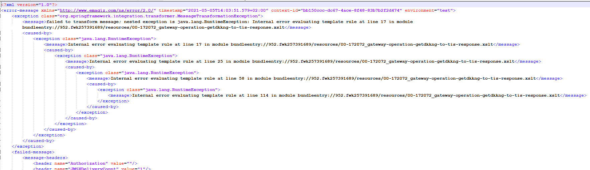
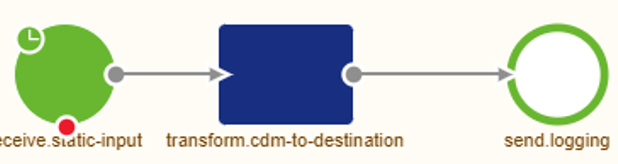
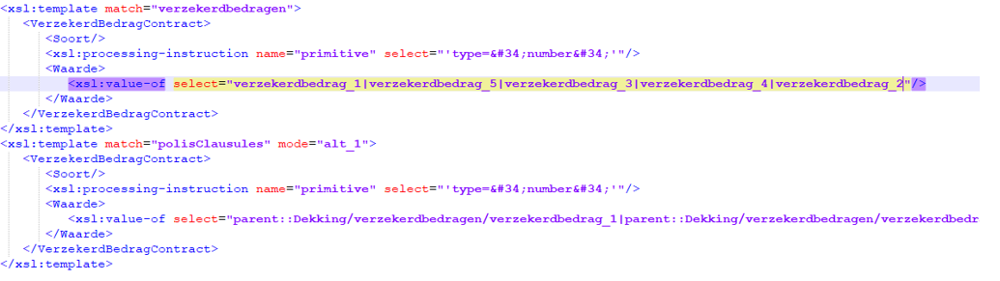

    

        <main class="micro-learning">
        <ul class="doc-nav">
            <li class="doc-nav__item"><a href="../../docs/rca-knowledgebase/index_academy_rca-knowledgebase_all" class="doc-nav__link">Home</a></li>
            <li class="doc-nav__item"><a href="#situation" class="doc-nav__link">Situation</a></li>
            <li class="doc-nav__item"><a href="#problem" class="doc-nav__link">Problem</a></li>
            <li class="doc-nav__item"><a href="#analysis" class="doc-nav__link">Analysis</a></li>
            <li class="doc-nav__item"><a href="#result" class="doc-nav__link">Result</a></li>
        </ul>

# RCA - Template match error for missing code mappings

In this document, we will use the information from the actual root cause analysis to make a generic view that can be used if you run into the same or a similar problem in the future. Finally, the document will describe the situation, the problem, the analysis, and the result.

Should you have any questions, please get in touch with academy@emagiz.com.

- Last update: March 15th, 2022
- Required reading time: 3 minutes

##### Situation

## 3. RCA - Data type issues in transformation - many to one

### 3.1 Situation
When developing an exit gate as part of an API Gateway, the exit gate run well. The Exit Gate receives an JSON input and transforms that to an XML structure, but when using the Exit Gate with an actual request a log entry is created indicating that the message can't be transformed 

##### Problem

### 3.2 Problem
The problem in this case was that some messages where processed, whilst other ones where not. 

##### Analysis

### 3.3 Analysis

#### 3.3.1 Errors in eMagiz
To analyze the problem, we first looked at the errors within the environment to get a sense of the issue at hand. See below for the errors observed. The error indicates that the transformation doesn't work for a specific message. The template rule evaluation error indicates this more specifically as can be seen below.

#### 3.3.2 Transformation analysis

We have created a small flow that takes the failed message as input for a file-pickup, and then uses the transformation resource from the exit gate to transform. Using a Flow test, you can see what the outcome is and have a better view on the actual location of the transformation problem.

Inspecting the logs resulted in a indication that in the transformation, a target attributes was mapped from multiple input fields. The target attribute data type didn't always match with a mapped source attributes' datatypes. This causes the error in eMagiz. To cross check this, the mapping was slightly changed so that a single input attributes was used with the same data type.

##### Result

### 3.4 Result
Once the mapping was fixed so that the target attributes was always filled with data of the proper data type, the issue didn't occur anymore.

</main>

