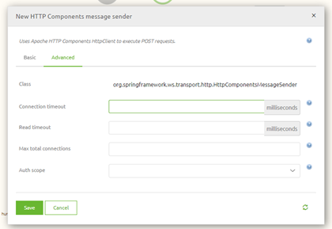

    

        <main class="micro-learning">
        <ul class="doc-nav">
            <li class="doc-nav__item"><a href="../../docs/rca-knowledgebase/index_academy_rca-knowledgebase_all" class="doc-nav__link">Home</a></li>
            <li class="doc-nav__item"><a href="#situation" class="doc-nav__link">Situation</a></li>
            <li class="doc-nav__item"><a href="#problem" class="doc-nav__link">Problem</a></li>
            <li class="doc-nav__item"><a href="#analysis" class="doc-nav__link">Analysis</a></li>
            <li class="doc-nav__item"><a href="#result" class="doc-nav__link">Result</a></li>
        </ul>

# RCA - Timeout occurred on a web service call

In this document, we will use the information from the actual root cause analysis to make a generic view that can be used if you run into the same or a similar problem in the future. Finally, the document will describe the situation, the problem, the analysis, and the result.

Should you have any questions, please get in touch with academy@emagiz.com.

- Last update: March 8th, 2022
- Required reading time: 3 minutes

##### Situation

## 3. RCA - Timeout occurred on a web service call

### 3.1 Situation
At some point, questions were raised that the connection between eMagiz and an external SOAP web service ran into timeouts. 

##### Problem

### 3.2 Problem
Because the eMagiz solution ran into timeouts, data could not be synchronized between various systems within the integration landscape of the client. As a result, part of the functionality of the clients' systems was not functioning correctly.

##### Analysis

### 3.3 Analysis

#### 3.3.1 Errors in eMagiz
We learned that calling the web service from a tool such as SOAP UI took a little over one minute when looking into an issue. This was the first signal to consider the option that because the call was taking over a minute, eMagiz shut down the connection before the call could be finished. This is because, on default, eMagiz holds a connection open for a maximum of one minute before closing the connection.

A specific support component needs to be added to the flow and linked to the web service in question to change this behavior. This component is called the HTTP components message sender. With this component, you can increase the time eMagiz will wait before shutting down the connection.

Once you have configured this to a value more extensive than the expected time it takes to finish the call, you will prevent the timeouts from occurring in eMagiz.

##### Result

### 3.4 Result

The analysis concluded that adding a support object on flow level is needed to overwrite the default timeout setting of eMagiz of 1 minute. Once this is done, the timeout errors should be a thing of the past.

</main>

