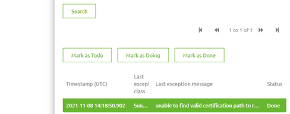
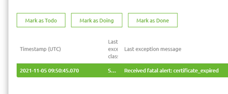
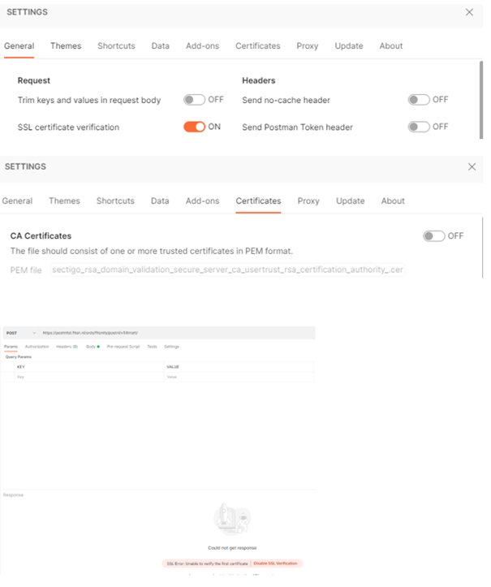
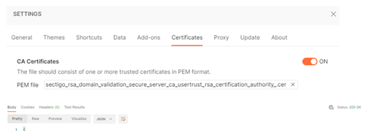
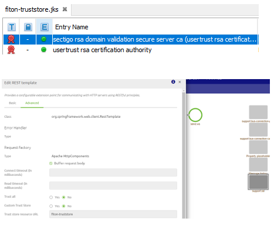

    

        <main class="micro-learning">
        <ul class="doc-nav">
            <li class="doc-nav__item"><a href="../../docs/rca-knowledgebase/index_academy_rca-knowledgebase_all" class="doc-nav__link">Home</a></li>
            <li class="doc-nav__item"><a href="#situation" class="doc-nav__link">Situation</a></li>
            <li class="doc-nav__item"><a href="#problem" class="doc-nav__link">Problem</a></li>
            <li class="doc-nav__item"><a href="#analysis" class="doc-nav__link">Analysis</a></li>
            <li class="doc-nav__item"><a href="#result" class="doc-nav__link">Result</a></li>
        </ul>

# RCA - Unable to find valid certification path

In this document, we will use the information from the actual root cause analysis to make a generic view that can be used if you run into the same or a similar problem in the future. Finally, the document will describe the situation, the problem, the analysis, and the result.

Should you have any questions, please get in touch with academy@emagiz.com.

- Last update: March 8th, 2022
- Required reading time: 4 minutes

##### Situation

## 3. RCA - Unable to find valid certification path

### 3.1 Situation
On a specific working day, a connection between eMagiz and an external REST service broke down due to errors related to certificate problems. The external party updated the trusted certificates, but they did not notify the client team working on the eMagiz solution. 

##### Problem

### 3.2 Problem
As a result of these actions, no data could be supplied to the system before the problem was resolved.

##### Analysis

### 3.3 Analysis

#### 3.3.1 Errors in eMagiz
To analyze the problem, we first looked at the errors within the environment to get a sense of the issue at hand. See below for the errors we saw.

#### 3.3.2 Call endpoint in Postman with SSL verification on

Secondly, we navigated to the endpoint via the browser to determine the certificate chain of the external party. Once we had established the certificate chain, we tested the connection via Postman.
When calling the external application with SSL verification turned on but no Certificates configured, we get the below error. This indicates that Postman does not trust the external party enough to establish a proper connection.

The call works again when we add the intermediate certificate to the list of trusted certificates.

#### 3.3.3 Truststore configuration and configuration in eMagiz

With these results, we have added the intermediate and the CA certificate to a custom truststore for the external party and linked the truststore to the HTTP outbound gateway.

##### Result

### 3.4 Result

The analysis concluded that there is a mismatch between the certificates used at the external party and those on default trusted by various software parties (including Java). The best course of action would be to use a certificate structure in which the entire certificate chain (intermediate and CA) is trusted adequately on default. This removes the need for custom configuration in the form of a custom truststore that needs to be managed at the eMagiz side and updated every time the external parties certificate changes.

When that is impossible, there should be ongoing communication between the external party and the implementation team at the eMagiz environment when certificates are changed or expired. Those moments could trigger the need to change the custom truststore that the integration team must use within the eMagiz model to establish the connection.

</main>

