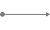

This page lists all components available in the flow designer grouped by *type* (transformer, filter, router, etc). The same list but grouped by *category* (HTTP/REST, web services, EDI, etc) is available [here](index2.md).

A component with ~~strikethrough~~ indicates it is deprecated: hover to see the recommended alternative. Some components in the flow designer have additional settings that are (usually) accessed through new/edit/delete buttons: these "nested" components are listed as sub-items of the relevant component in the list below.

##  Inbound channel adapters
An inbound channel adapter connects a source system to a message flow in an asynchronous (fire-and-forget) fashion. These inbound endpoints can be message-driven or pollable.
- [File inbound channel adapter](file-inbound-channel-adapter.md)
- [File item reader message source](file-item-reader-message-source.md)
- [FTP inbound channel adapter](ftp-inbound-channel-adapter.md)
- [HTTP inbound channel adapter](http-inbound-channel-adapter.md)
  - [HTTP header](http-header.md)
- [IMAP idle channel adapter](imap-idle-channel-adapter.md)
- [JDBC inbound channel adapter](jdbc-inbound-channel-adapter.md)
- [JDBC stored procedure inbound channel adapter](jdbc-stored-procedure-inbound-channel-adapter.md)
  - [JDBC parameter](jdbc-parameter.md)
  - [JDBC SQL parameter definition](jdbc-sql-parameter-definition.md)
- [JMS inbound channel adapter](jms-inbound-channel-adapter.md)
- [JMS message driven channel adapter](jms-message-driven-channel-adapter.md)
- [JMX multi attribute polling message source](jmx-multi-attribute-polling-message-source.md)
- Kafka message driven channel adapter
- [Log appender channel adapter](log-appender-channel-adapter.md)
- [Mail inbound channel adapter](mail-inbound-channel-adapter.md)
- [SFTP inbound channel adapter](sftp-inbound-channel-adapter.md)
- [Standard inbound channel adapter](standard-inbound-channel-adapter.md)
- [TCP inbound channel adapter](tcp-inbound-channel-adapter.md)
- [XMPP inbound channel adapter](xmpp-inbound-channel-adapter.md)
- [XMPP presence inbound channel adapter](xmpp-presence-inbound-channel-adapter.md)
- [HTTP inbound endpoint dispatcher servlet](http-inbound-endpoint-dispatcher-servlet.md)

##  Inbound gateways
An inbound gateway connects a source system to a message flow in a synchronous (request-response) fashion. These inbound endpoints are always message-driven.
- [ActiveMQ security manager gateway](activemq-security-manager-gateway.md)
- [Command executor gateway](command-executor-gateway.md)
- ~~[HornetQ security manager gateway](hornetq-security-manager-gateway.md "Deprecated: use ActiveMQ security manager gateway")~~
- [HTTP inbound gateway](http-inbound-gateway.md)
  - [HTTP header](http-header.md)
- [JMS inbound gateway](jms-inbound-gateway.md)
- Job execution listener gateway
- [Mapping service gateway](mapping-service-gateway.md)
- Step execution listener gateway
- [TCP inbound gateway](tcp-inbound-gateway.md)
- [Web service inbound gateway](web-service-inbound-gateway.md)
- [XSLT extension gateway](xslt-extension-gateway.md)

##  Outbound channel adapters
An outbound channel adapter connects a message flow to a target system in an asynchronous (fire-and-forget) fashion.
- [File outbound channel adapter](file-outbound-channel-adapter.md)
  - [Expression evaluating request handler advice](expression-evaluating-request-handler-advice.md)
  - [Request handler circuit breaker advice](request-handler-circuit-breaker-advice.md)
  - [Request handler retry advice](request-handler-retry-advice.md)
- [FTP outbound channel adapter](ftp-outbound-channel-adapter.md)
  - [Expression evaluating request handler advice](expression-evaluating-request-handler-advice.md)
  - [Request handler circuit breaker advice](request-handler-circuit-breaker-advice.md)
  - [Request handler retry advice](request-handler-retry-advice.md)
- [HTTP outbound channel adapter](http-outbound-channel-adapter.md)
  - [Expression evaluating request handler advice](expression-evaluating-request-handler-advice.md)
  - [HTTP URI variable](http-uri-variable.md)
  - OAuth 2.0 access token advice
  - [Request handler circuit breaker advice](request-handler-circuit-breaker-advice.md)
  - [Request handler retry advice](request-handler-retry-advice.md)
- [JDBC outbound channel adapter](jdbc-outbound-channel-adapter.md)
  - [Expression evaluating request handler advice](expression-evaluating-request-handler-advice.md)
  - [Request handler circuit breaker advice](request-handler-circuit-breaker-advice.md)
  - [Request handler retry advice](request-handler-retry-advice.md)
- [JDBC stored procedure outbound channel adapter](jdbc-stored-procedure-outbound-channel-adapter.md)
  - [Expression evaluating request handler advice](expression-evaluating-request-handler-advice.md)
  - [JDBC parameter](jdbc-parameter.md)
  - [JDBC SQL parameter definition](jdbc-sql-parameter-definition.md)
  - [Request handler circuit breaker advice](request-handler-circuit-breaker-advice.md)
  - [Request handler retry advice](request-handler-retry-advice.md)
- [JMS outbound channel adapter](jms-outbound-channel-adapter.md)
  - [Expression evaluating request handler advice](expression-evaluating-request-handler-advice.md)
  - [Request handler circuit breaker advice](request-handler-circuit-breaker-advice.md)
  - [Request handler retry advice](request-handler-retry-advice.md)
- Kafka outbound channel adapter
  - [Expression evaluating request handler advice](expression-evaluating-request-handler-advice.md)
  - [Request handler circuit breaker advice](request-handler-circuit-breaker-advice.md)
  - [Request handler retry advice](request-handler-retry-advice.md)
- [Logging channel adapter](logging-channel-adapter.md)
- [Mail outbound channel adapter](mail-outbound-channel-adapter.md)
  - [Expression evaluating request handler advice](expression-evaluating-request-handler-advice.md)
  - [Request handler circuit breaker advice](request-handler-circuit-breaker-advice.md)
  - [Request handler retry advice](request-handler-retry-advice.md)
- ~~[Microflow invoking message consumer](microflow-invoking-message-consumer.md "Deprecated: use eMagiz Mendix Connector")~~
- [SFTP outbound channel adapter](sftp-outbound-channel-adapter.md)
  - [Expression evaluating request handler advice](expression-evaluating-request-handler-advice.md)
  - [Request handler circuit breaker advice](request-handler-circuit-breaker-advice.md)
  - [Request handler retry advice](request-handler-retry-advice.md)
- [TCP outbound channel adapter](tcp-outbound-channel-adapter.md)
  - [Expression evaluating request handler advice](expression-evaluating-request-handler-advice.md)
  - [Request handler circuit breaker advice](request-handler-circuit-breaker-advice.md)
  - [Request handler retry advice](request-handler-retry-advice.md)
- ~~[XML mapping message consumer](xml-mapping-message-consumer.md "Deprecated: use eMagiz Mendix Connector")~~
- [XMPP outbound channel adapter](xmpp-outbound-channel-adapter.md)
  - [Expression evaluating request handler advice](expression-evaluating-request-handler-advice.md)
  - [Request handler circuit breaker advice](request-handler-circuit-breaker-advice.md)
  - [Request handler retry advice](request-handler-retry-advice.md)
- [XMPP presence outbound channel adapter](xmpp-presence-outbound-channel-adapter.md)
  - [Expression evaluating request handler advice](expression-evaluating-request-handler-advice.md)
  - [Request handler circuit breaker advice](request-handler-circuit-breaker-advice.md)
  - [Request handler retry advice](request-handler-retry-advice.md)

##  Outbound gateways
An outbound gateway connects a message flow to a target system in a synchronous (request-response) fashion.
- [HTTP outbound gateway](http-outbound-gateway.md)
  - [Expression evaluating request handler advice](expression-evaluating-request-handler-advice.md)
  - [HTTP URI variable](http-uri-variable.md)
  - OAuth 2.0 access token advice
  - [Request handler circuit breaker advice](request-handler-circuit-breaker-advice.md)
  - [Request handler retry advice](request-handler-retry-advice.md)
- [JDBC outbound gateway](jdbc-outbound-gateway.md)
  - [Expression evaluating request handler advice](expression-evaluating-request-handler-advice.md)
  - [Request handler circuit breaker advice](request-handler-circuit-breaker-advice.md)
  - [Request handler retry advice](request-handler-retry-advice.md)
- [JDBC stored procedure outbound gateway](jdbc-stored-procedure-outbound-gateway.md)
  - [Expression evaluating request handler advice](expression-evaluating-request-handler-advice.md)
  - [JDBC parameter](jdbc-parameter.md)
  - [JDBC SQL parameter definition](jdbc-sql-parameter-definition.md)
  - [Request handler circuit breaker advice](request-handler-circuit-breaker-advice.md)
  - [Request handler retry advice](request-handler-retry-advice.md)
- [JMS outbound gateway](jms-outbound-gateway.md)
  - [Expression evaluating request handler advice](expression-evaluating-request-handler-advice.md)
  - [Request handler circuit breaker advice](request-handler-circuit-breaker-advice.md)
  - [Request handler retry advice](request-handler-retry-advice.md)
- Job launching outbound gateway
- [TCP outbound gateway](tcp-outbound-gateway.md)
  - [Expression evaluating request handler advice](expression-evaluating-request-handler-advice.md)
  - [Request handler circuit breaker advice](request-handler-circuit-breaker-advice.md)
  - [Request handler retry advice](request-handler-retry-advice.md)
- [Web service outbound gateway](web-service-outbound-gateway.md)
  - [Expression evaluating request handler advice](expression-evaluating-request-handler-advice.md)
  - [Request handler circuit breaker advice](request-handler-circuit-breaker-advice.md)
  - [Request handler retry advice](request-handler-retry-advice.md)
  - [Web service URI variable](web-service-uri-variable.md)

##  Transformers
A transformer converts a message's content or structure, e.g. by converting the payload of the message from one format to another or modifying the message's header values.
- [Base64 decoding transformer](base64-decoding-transformer.md)
- [Base64 encoding transformer](base64-encoding-transformer.md)
- [Character replacing transformer](character-replacing-transformer.md)
- EDI to XML transformer
- [Error to XML transformer](error-to-xml-transformer.md)
- [File to bytes transformer](file-to-bytes-transformer.md)
- [File to string transformer](file-to-string-transformer.md)
- Flat file to XML transformer
- [Header filter](header-filter.md)
- [HTTP parameter map to XML transformer](parameter-map-to-xml-transformer.md)
- [Image transformer](image-transformer.md)
- ISO8583 bytes to XML transformer
- ISO8583 XML to bytes transformer
- [JDBC result set to XML transformer](jdbc-result-set-to-xml-transformer.md)
- [JSON to XML transformer](json-to-xml-transformer.md)
- [Mail attachment transformer](mail-attachment-transformer.md)
- [Mail header enricher](mail-header-enricher.md)
  - [Attachment filename](mail-header-enricher---attachment-filename.md)
  - [Bcc](mail-header-enricher---bcc.md)
  - [Cc](mail-header-enricher---cc.md)
  - [Content type](mail-header-enricher---content-type.md)
  - [From](mail-header-enricher---from.md)
  - [Multipart mode](mail-header-enricher---multipart-mode.md)
  - [Reply to](mail-header-enricher---reply-to.md)
  - [Subject](mail-header-enricher---subject.md)
  - [To](mail-header-enricher---to.md)
- [Mail to string transformer](mail-to-string-transformer.md)
- [Mendix FileDocument WS request transformer](mendix-filedocument-ws-request-transformer.md)
- [MIME message to XML transformer](mime-message-to-xml-transformer.md)
- [MIME to S/MIME transformer](mime-to-s-mime-transformer.md)
- [Object to string transformer](object-to-string-transformer.md)
- [S/MIME to MIME transformer](s-mime-to-mime-transformer.md)
- [Standard header enricher](standard-header-enricher.md)
  - [Correlation id](standard-header-enricher---correlation-id.md)
  - [Custom header](standard-header-enricher---custom-header.md)
  - [Error channel](standard-header-enricher---error-channel.md)
  - [Expiration date](standard-header-enricher---expiration-date.md)
  - [Priority](standard-header-enricher---priority.md)
  - [Reply channel](standard-header-enricher---reply-channel.md)
- [Standard transformer](standard-transformer.md)
  - [Groovy variable](groovy-variable.md)
- [String to wrapped XML transformer](string-to-wrapped-xml-transformer.md)
- UN/EDIFACT to XML transformer
- [Web service header enricher](web-service-header-enricher.md)
  - [SOAP action](web-service-header-enricher---soap-action.md)
- XML to EDI transformer
- XML to flat file transformer
- [XML to JSON transformer](xml-to-json-transformer.md)
- [XML to MIME message transformer](xml-to-mime-message-transformer.md)
- [XML to string transformer](xml-to-string-transformer.md)
- XML to UN/EDIFACT transformer
- [XMPP header enricher](xmpp-header-enricher.md)
  - [Chat thread id](xmpp-header-enricher---chat-thread-id.md)
  - [Chat to](xmpp-header-enricher---chat-to.md)
- [XMPP presence to XML transformer](xmpp-presence-to-xml-transformer.md)
- [XPath header enricher](xpath-header-enricher.md)
  - [Header](xpath-header-enricher---header.md)
- [XPath transformer](xpath-transformer.md)
- [XSLT transformer](xslt-transformer.md)
  - [XSLT parameter](xslt-parameter.md)

##  Splitters
A splitter converts a single (large) message into multiple (smaller) messages.
- [Standard splitter](standard-splitter.md)
  - [Groovy variable](groovy-variable.md)
- [XPath splitter](xpath-splitter.md)

##  Filters
A filter determines whether a message should be accepted (passed through) or rejected (discarded). Rejected messages can either be silently dropped or trigger the flow's error handling.
- [Standard filter](standard-filter.md)
  - [Groovy variable](groovy-variable.md)
- [XML validating filter](xml-validating-filter.md)
- [XPath filter](xpath-filter.md)

##  Routers
A router decides where a message should go next (if anywhere). Messages can be send to multiple destinations, in which case they are duplicated.
- [Header value router](header-value-router.md)
  - [Header value mapping](header-value-mapping.md)
- [Payload type router](payload-type-router.md)
  - [Payload type mapping](payload-type-mapping.md)
- [Recipient list router](recipient-list-router.md)
  - [Recipient](recipient.md)
- [Standard router](standard-router.md)
  - [Groovy variable](groovy-variable.md)
  - [Value mapping](value-mapping.md)
- [XPath router](xpath-router.md)
  - [XPath value mapping](xpath-value-mapping.md)

##  Service activators
A service activator triggers a service instance when receiving a message. If this service returns a value the service activator functions similar to a transformer, if not it can be compared to an outbound channel adapter.
- [Control bus](control-bus.md)
- [Custom error message activator](custom-error-message-activator.md)
  - [Expression evaluating request handler advice](expression-evaluating-request-handler-advice.md)
  - [Request handler circuit breaker advice](request-handler-circuit-breaker-advice.md)
  - [Request handler retry advice](request-handler-retry-advice.md)
- [Message bridge](message-bridge.md)
- [Mikrotik service activator](mikrotik-service-activator.md)
  - [Expression evaluating request handler advice](expression-evaluating-request-handler-advice.md)
  - [Request handler circuit breaker advice](request-handler-circuit-breaker-advice.md)
  - [Request handler retry advice](request-handler-retry-advice.md)
- [Standard service activator](standard-service-activator.md)
  - [Expression evaluating request handler advice](expression-evaluating-request-handler-advice.md)
  - [Groovy variable](groovy-variable.md)
  - [Request handler circuit breaker advice](request-handler-circuit-breaker-advice.md)
  - [Request handler retry advice](request-handler-retry-advice.md)
- ThClient changes reading activator
  - [Expression evaluating request handler advice](expression-evaluating-request-handler-advice.md)
  - [Request handler circuit breaker advice](request-handler-circuit-breaker-advice.md)
  - [Request handler retry advice](request-handler-retry-advice.md)
- ThClient table reading activator
  - [Expression evaluating request handler advice](expression-evaluating-request-handler-advice.md)
  - [Request handler circuit breaker advice](request-handler-circuit-breaker-advice.md)
  - [Request handler retry advice](request-handler-retry-advice.md)

##  Channels
Channels connect all the other flow components, decoupling them and also providing a convenient point for interception and monitoring of messages.
- [Default channel](channel.md)
  - [Debug interceptor](debug-interceptor.md)
  - ~~[Entry tracking interceptor](entry-tracking-interceptor.md "Deprecated: functionality replaced by debugging, flow testing, message archiving")~~
  - ~~[Exit tracking interceptor](exit-tracking-interceptor.md "Deprecated: functionality replaced by debugging, flow testing, message archiving")~~
  - [Wire tap](wire-tap.md)

##  Support objects
A support object interacts in some way with other flow components (usually extending their functionality), but is never directly part of a message flow.
- [Apache ActiveMQ Artemis server](apache-activemq-artemis-server.md)
  - [Address settings](address-settings.md)
  - [Cluster connection](cluster-connection.md)
  - [In-VM acceptor](in-vm-acceptor.md)
  - [In-VM connector](in-vm-connector.md)
  - [Netty acceptor](netty-acceptor.md)
  - [Netty connector](netty-connector.md)
  - [Security settings](security-settings.md)
- [Byte array CR/LF (de)serializer](byte-array-cr-lf--de-serializer.md)
- [Byte array length header (de)serializer](byte-array-length-header--de-serializer.md)
- [Byte array raw (de)serializer](byte-array-raw--de-serializer.md)
- [Byte array single terminator (de)serializer](byte-array-single-terminator--de-serializer.md)
- [Byte array STX/ETX (de)serializer](byte-array-stx-etx--de-serializer.md)
- [Byte array text length header (de)serializer](byte-array-text-length-header--de-serializer.md)
- [Cache annotation driven](cache-annotation-driven.md)
- [Command controller](command-controller.md)
- Complex SOAP header mapper
  - [SOAP to message header mapping](soap-to-message-header-mapping.md)
- [Composite cache manager](composite-cache-manager.md)
- [Composite file list filter](composite-file-list-filter.md)
  - [Accept once file list filter](accept-once-file-list-filter.md)
  - [Accept once per modification file list filter](accept-once-per-modification-file-list-filter.md)
  - [Age file list filter](age-file-list-filter.md)
  - [Delaying file list filter](delaying-file-list-filter.md)
  - [Lock-file file list filter](lock-file-file-list-filter.md)
  - [Regex pattern file list filter](regex-pattern-file-list-filter.md)
  - Regular files only file list filter
  - [Simple pattern file list filter](simple-pattern-file-list-filter.md)
  - [Size file list filter](size-file-list-filter.md)
- [Concurrent map cache manager](concurrent-map-cache-manager.md)
- Default execution context serializer
- [Default FTP caching session factory](default-ftp-caching-session-factory.md)
- [Default FTP session factory](default-ftp-session-factory.md)
- [Default FTPS caching session factory](default-ftps-caching-session-factory.md)
- [Default FTPS session factory](default-ftps-session-factory.md)
- [Default HTTP header mapper](default-http-header-mapper.md)
- [Default SFTP caching session factory](default-sftp-caching-session-factory.md)
- [Default SFTP session factory](default-sftp-session-factory.md)
- [Default TCP SSL context support](default-tcp-ssl-context-support.md)
- Default WSDL 1.1 definition
- Detailed SOAP fault message resolver
- [Ehcache cache manager](ehcache-cache-manager.md)
  - [Ehcache cache](ehcache-cache.md)
- [Flow controller](flow-controller.md)
- [Format file name generator](format-filename-generator.md)
- [FOP XSL-FO result factory](fop-xsl-fo-result-factory.md)
- [FOP XSL-FO result transformer](fop-xsl-fo-result-transformer.md)
- [FTP composite file list filter](ftp-composite-file-list-filter.md)
  - [Accept once file list filter](accept-once-file-list-filter.md)
  - [Delaying file list filter](delaying-file-list-filter.md)
  - [FTP accept once per modification file list filter](ftp-accept-once-per-modification-file-list-filter.md)
  - [FTP age file list filter](ftp-age-file-list-filter.md)
  - [FTP lock-file file list filter](ftp-lock-file-file-list-filter.md)
  - [FTP regex pattern file list filter](ftp-regex-pattern-file-list-filter.md)
  - FTP regular files only file list filter
  - [FTP simple pattern file list filter](ftp-simple-pattern-file-list-filter.md)
  - [FTP size file list filter](ftp-size-file-list-filter.md)
- [Global channel interceptor](global-channel-interceptor.md)
- [Global wire tap](global-wire-tap.md)
- ~~[HornetQ caching connection factory](hornetq-caching-connection-factory.md "Deprecated: use JMS caching connection factory")~~
- ~~[HornetQ connection factory](hornetq-connection-factory.md "Deprecated: use Qpid JMS connection factory")~~
- ~~[HornetQ JMS server manager](hornetq-jms-server-manager.md "Deprecated: use Apache ActiveMQ Artemis server")~~
  - ~~[Address settings](address-settings.md "Deprecated: use Apache ActiveMQ Artemis server")~~
  - ~~[Bridge configuration](bridge-configuration.md "Deprecated: use Apache ActiveMQ Artemis server")~~
  - ~~[Cluster connection configuration](cluster-connection-configuration.md "Deprecated: use Apache ActiveMQ Artemis server")~~
  - ~~[Connector transport configuration](connector-transport-configuration.md "Deprecated: use Apache ActiveMQ Artemis server")~~
  - ~~[In-VM acceptor transport configuration](in-vm-acceptor-transport-configuration.md "Deprecated: use Apache ActiveMQ Artemis server")~~
  - ~~[In-VM connector transport configuration](in-vm-connector-transport-configuration.md "Deprecated: use Apache ActiveMQ Artemis server")~~
  - ~~[JMS queue configuration](jms-queue-configuration.md "Deprecated: use Apache ActiveMQ Artemis server")~~
  - ~~[Netty acceptor transport configuration](netty-acceptor-transport-configuration.md "Deprecated: use Apache ActiveMQ Artemis server")~~
  - ~~[Netty connector transport configuration](netty-connector-transport-configuration.md "Deprecated: use Apache ActiveMQ Artemis server")~~
  - ~~[Security settings](security-settings.md "Deprecated: use Apache ActiveMQ Artemis server")~~
  - ~~[Topic configuration](topic-configuration.md "Deprecated: use Apache ActiveMQ Artemis server")~~
- HTTP Components message sender
- [Java mail sender](java-mail-sender.md)
- [JDBC BoneCP data source](jdbc-bonecp-data-source.md)
- [JDBC channel message store](jdbc-channel-message-store.md)
- [JDBC data source transaction manager](data-source-transaction-manager.md)
- JDBC H2 connection pool
- [JDBC initialize database](jdbc-initialize-database.md)
  - [SQL script](sql-script.md)
- [JDBC OSGi data source reference](jdbc-osgi-data-source-reference.md)
- Jetty server
- [JMS caching connection factory](jms-caching-connection-factory.md)
- [JMS listener container](jms-listener-container.md)
  - [JMS listener](jms-listener.md)
- JMS OSGi connection factory reference
- [JMS XML message converter](jms-xml-message-converter.md)
- Job
- Job manager
- Job registry bean post processor
- Job repository
- Kafka message listener container
- Kafka template
- [Management](management.md)
- Map job registry
- [MBean export](mbean-export.md)
- [MBean server](mbean-server.md)
- Mendix authentication SAAJ SOAP interceptor
- [Mendix authentication SOAP header mapper](mendix-authentication-soap-header-mapper.md)
- Merlin crypto
- [Message history](message-history.md)
- Metacom authentication SAAJ SOAP interceptor
- No-op JMS header mapper
- OAuth 2.0 resource
- OAuth 2.0 REST template
- [OSGi service](osgi-service.md)
- [Performance monitor](jvm-performance-monitor.md)
- [Properties](properties.md)
- [Property placeholder](property-placeholder.md)
- Proxy web service message sender
- [Qpid JMS connection factory](qpid-jms-connection-factory.md)
  - [AMQP connector settings](qpid-amqp-connector-setting.md)
- [REST template](rest-template.md)
  - [Amazon S3 authentication interceptor](amazon-s3-authentication-interceptor.md)
  - [Azure Storage Services authentication interceptor](azure-storage-services-authentication-interceptor.md)
  - [Basic access authentication interceptor](basic-access-authentication-interceptor.md)
- [Result to document transformer](result-to-document-transformer.md)
- [Result to string transformer](result-to-string-transformer.md)
- SAAJ SOAP message factory
- [SFTP composite file list filter](sftp-composite-file-list-filter.md)
  - [Accept once file list filter](accept-once-file-list-filter.md)
  - [Delaying file list filter](delaying-file-list-filter.md)
  - [SFTP accept once per modification file list filter](sftp-accept-once-per-modification-file-list-filter.md)
  - [SFTP age file list filter](sftp-age-file-list-filter.md)
  - [SFTP lock-file file list filter](sftp-lock-file-file-list-filter.md)
  - [SFTP regex pattern file list filter](sftp-regex-pattern-file-list-filter.md)
  - SFTP regular files only file list filter
  - [SFTP simple pattern file list filter](sftp-simple-pattern-file-list-filter.md)
  - [SFTP size file list filter](sftp-size-file-list-filter.md)
- [Simple cache manager](simple-cache-manager.md)
  - [Concurrent map cache](concurrent-map-cache.md)
- Simple job launcher
- Simple XSD schema
- Simple WSDL 1.1 definition
- SOAP action callback
- [SOAP attachments header mapper](soap-attachments-header-mapper.md)
- SOAP fault message resolver
- SOAP message dispatcher
- ~~[Sonic caching connection factory](sonic-caching-connection-factory.md "Deprecated: use JMS caching connection factory")~~
- [Sonic connection factory](sonic-connection-factory.md)
- SSL web service message sender
- [Task executor](task-executor.md)
- [TCP connection factory](tcp-connection-factory.md)
- ThClient connector
- [Timestamped file name generator](timestamped-filename-generator.md)
- [Top level poller](poller.md)
- Web service message listener
- ~~[WebSphere caching connection factory](websphere-caching-connection-factory.md "Deprecated: use JMS caching connection factory")~~
- [WebSphere connection factory](websphere-connection-factory.md)
- WS-Addressing action callback
- WSS4J security interceptor
- [XMPP connection](xmpp-connection.md)
- [XPath expression](xpath-expression.md)
- XSLT view
- Zimbra authentication SAAJ SOAP interceptor
